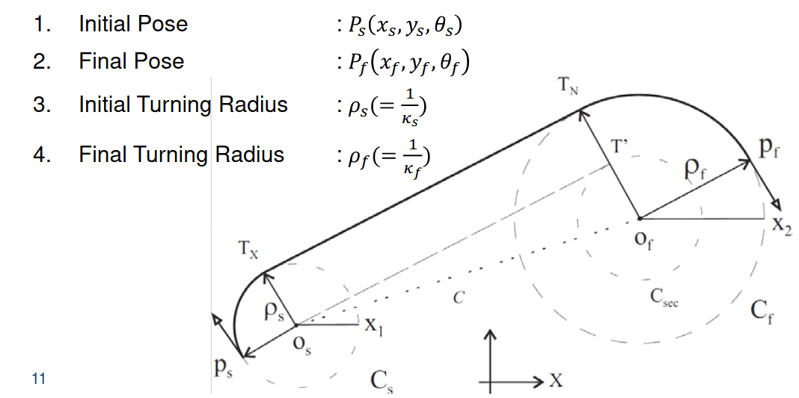
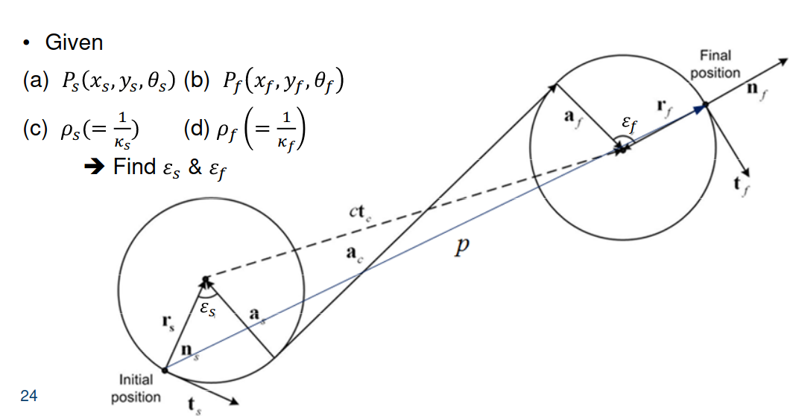
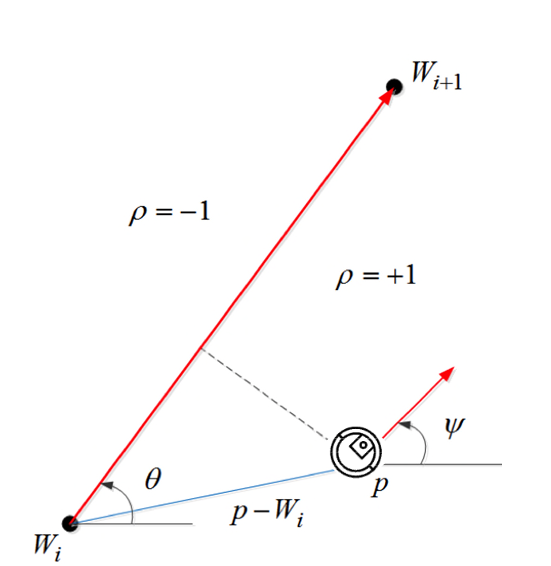

#  Path Planning

**Target**

Given initial Pose: $P_i(x, y,q)$

Move robot to the given final pose $P_f(x,y,q)$

Path planning: Finding a `smooth` `continuous` path between two poses

**Dubins Set**: Shortest Paths of Bounded Curvature $\mathcal{D}$

1. Combines circle and straight lines
2. Shortest path is denoted as `CCC` or `CSC`
3. Set to determine the shortest path with the constraint 

Consists of 6 admissible paths $\mathcal{D} = \{LSL, RSR, RSL, LSR, RLR, LRL\}$

`C`: Circle, `S`:Straight, `L`: Left, `R`:Right

**Lecture conditions**

1. $\Large \{C_{sl}\cup C_{sr}\}\cap\{C_{\text{fl}}\cup C_{\text{fr}}\} = \varnothing$, `s`: initial, `f`:finial, `l`: left, `r`:right
2. `CCC` cannot be the optimal solution

**Step 1**

Find the centres of the using circles $\Large O_s(x_{\text{cs}}, y_{\text{cs}})$ and $\Large O_f(x_{\text{cs}}, y_{\text{cs}})$
$$
\Large
\begin{align}
(x_{cs}, y_{cs}) = (x_s \pm \rho_scos(\theta_s\pm\frac{\pi}{2}), y_s \pm \rho_ssin(\theta_s\pm \frac{\pi}{2}))\\
(x_{cf}, y_{cf}) = (x_f \pm \rho_fcos(\theta_f\pm\frac{\pi}{2}), y_f \pm \rho_f sin(\theta_f\pm \frac{\pi}{2}))\\

\end{align}
$$
**Step 2**

Draw a secondary circle of radius $|\rho_f - \rho_s|$ at $O_f$ for $\rho\leq \rho_f$

**Step 3**

Connect the centres $O_s$ and $O_f$ to form a line $c$, called centre line, where 
$$
\Large |c| = \sqrt{(x_{cs}-x_s)^2 + (y_{cs} - y_s)^2}
$$
**Step 4**

Draw a line $O_s T^{'}$ tangent to the secondary circle

**Step 5**

Draw a perpendicular straight line from $O_f$ to $O_sT^{'}$ which intersects the primary circle $C_f$ at $T_N$, which is called as a tangent entry point on $C_f$

**Step 6**

Draw a line $T_XT_N$ parallel to $O_sT^{'}$, where $T_X$ is called as a tangent exit point on $C_s$

**Step 7**

Connect the points $P_s$ and $T_X$ by an arc of radius $\rho_s$ and $P_f$ by an arc of radius $\rho_f$

$$
\Large \begin{align}
T_X &= (x_{cs} + \rho_s \cos(\phi_{ex}), y_{cs} + \rho_s \sin(\phi_{ex}))\\
T_N &= (x_{cf} + \rho_f \cos(\phi_{en}), y_{cf} + \rho_f \sin(\phi_{ef}))\\
\end{align}
$$

# Dubins Path using Differential Geometry

​                                                                     
$$
\Large \bold{e}_s = [\bold{t}_s, \bold{n}_s], \bold{e}_c = [\bold{t}_c, \bold{n}_c], \bold{e}_f = [\bold{t}_f, \bold{n}_f]
$$

$$
\Large \bold{r}_s = \bold{e}_s\begin{bmatrix}0\\\pm\frac{1}{k_S} \end{bmatrix}, \bold{r}_f = \bold{e}_f\begin{bmatrix}0\\\pm\frac{1}{k_f} \end{bmatrix}
$$

$$
\Large \bold{t}_f = R(\mathcal{\varepsilon})\bold{t}_s
$$

where $R(\varepsilon)$ is rotation matrix to change the axis from initial to final
$$
\Large \varepsilon = \bold{t}_f^\intercal \bold{t}_s
$$
**Position vector**
$$
\Large \bold{p} = (\bold{r}_s -\bold{a}_s) + \bold{a}_c + (\bold{a}_f - \bold{r}_f)
$$

$$
\Large c\bold{t}_c = -\bold{a}_s + \bold{a}_c + \bold{a}_f
$$

$$
\Large \bold{a}_f = R(\varepsilon_S)^{'}\begin{bmatrix}0\\\pm\frac{1}{k_f}\end{bmatrix}, \bold{a}_s =  R(\varepsilon_S)^{'}\begin{bmatrix}0\\\pm\frac{1}{k_s}\end{bmatrix}, \bold{a}_c = R(\varepsilon_S)^{'}\begin{bmatrix}a\\0\end{bmatrix}
$$

# Carrot-Chasing Algorithm

## Straight line Following

a. Determine the cross-track error $d$

b. Update the location of the VTP

c. Update $\psi_d$ and $u$

Step 1:

Initialise: $\large W_i = (x_i, y_i), W_{i+1} = (x_{i+1}, y_{i+1}), \bold{p} = (x,y), \psi, \varepsilon,v_a, k$

Step 2:
$$
\Large
\begin{align}
R_u &= ||W_i-\bold{p}||\\
\theta &= \text{atan2}(y_{i+1}-y_i, x_{i+1} -x_i)\\
\end{align}
$$
Step 3:
$$
\Large
\begin{align}
\theta_u &= \text{atan2}(y-y_i, x-x_i)\\
\Delta\theta &= \theta - \theta_u
\end{align}
$$
Step 4:
$$
\Large R=\sqrt{R_u^2 - (R_usin\Delta\theta)^2}
$$
Step 5:
$$
\Large (x_t, y_t) \leftarrow (R+\delta)(cos(\theta), sin(\theta))\\
\Large \bold{s} = (x_t, y_t)
$$
Step 6:
$$
\Large \psi_d = \text{atan2}(y_t-y, x_t - x)
$$
Step 7:
$$
\Large u = \text{maxlim}(k(\psi_d - \psi)v_a)
$$

# Vector Field-Based Path Following

VFs indicates the direction of flow: if robot follows the VF direction == Robot will follow the path

## Straight-line following using VF algorithm

Initialise:
$$
\Large W_i = (x_i, y_i), W_{i+1} = (x_{i+1},y_{i+1}), \bold{p}, \psi, \chi^E, \tau, v_a, k, \alpha, k
$$
then
$$
\Large \theta = \text{atan2}(y_{i+1}-y_i, x_{i+1}-x_i)
$$

$$
\Large s^\star = \frac{(\bold{p}-W_i)^\intercal(W_{i+1}-W_i)}{||W_{i+1}-W_i||}
$$

