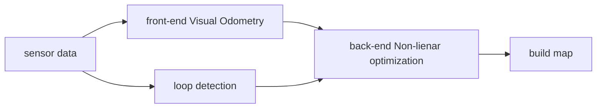

## SLAM

 经典的视觉SLAM流程

视觉里程计： 估算相邻图像间相机的运动以及局部的地图样子，也叫前端

后端优化：后端接受不同时刻视觉里程计的相机位姿，回环检测信息，并进行优化，得到全局一致的轨迹和地图

回环检测：判断机器人是否曾经达到过先前的位置，如果检测到，则提供给后端进行处理 

建图：根据估算的轨迹，建立与任务要求相对应的地图

对于静态，刚体，光照变化不明显的场景，没有人为干预的场景，SLAM技术已经很成熟

## Map

1. Metric Map
2. Topological Map

## SLAM Math representation

离散的时间 $t = 1, 2, ..., K$, $x$ 代表机器人的位置 $x_1, x_2, ..., x_K$. $N$ 个路标 $y_1, y_2, ..., y_N$

假设机器人携带者传感器在环境中运动，其由两件事描述

1. 什么是运动， 从$k-1$ 到$k$，机器人位置k如何变换
2. 什么是观测，在$k$时刻，于$x_k$处检测到了路标$y_j$

运动模型
$$
\Large x_k = f(x_{k-1},u_k, w_k)
$$
$u_k$: 传感器数据

$w_k$: 噪声

观测模型
$$
\Large z_{k,j} = h(y_j, x_k, v_{k, j})
$$
$y_j$: 路标

$v_{k,j}$: 噪声

