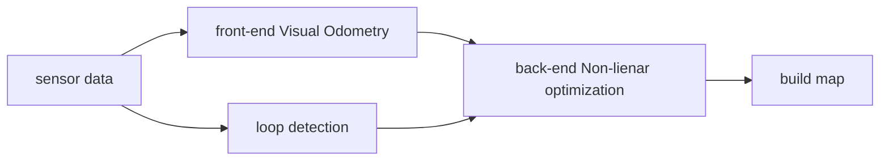

SO: Special Orthogonal Group

For a **Unit Orthogonal Basis** $[\bold{e}_1, \bold{e}_2, \bold{e}_3]$, after a rotation, the result is $[\bold{e}_1^\prime, \bold{e}_2^\prime, \bold{e}_3^\prime]$.

For a vector under this two coordinates are $[a_1, a_2, a_3]^\intercal$ and $[a_1^\prime, a_2^\prime, a_3^\prime]^\intercal$.

$$
\Large
$$
Rotation matrix set are following
$$
\Large SO(n) = \{\bold{R}\in\mathbb{R}^{n\times n}\vert \bold{RR}^\intercal =\bold{I}, \text{det}(\bold{R}) = 1\}
$$

Transformation matrix set are following
$$
\Large SO(3) = 
\left\{
\bold{T} = \begin{bmatrix}\bold{R}& \bold{t}\\\bold{0}^\intercal & 1\end{bmatrix}\in \mathbb{R}^{4\times4}\vert \bold{R}\in SO(3), \bold{t} \in \mathbb{R}^3
\right\}
$$
