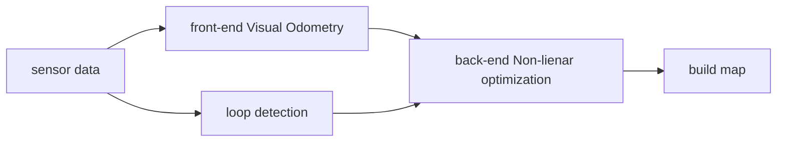

## SLAM

 经典的视觉SLAM流程

```mermaid
graph LR

A[sensor data]--> B[front-end Visual Odometry] -->C[back-end Non-lienar optimization] --> D[build map]
A --> E[loop detection]-->C

```

视觉里程计： 估算相邻图像间相机的运动以及局部的地图样子，也叫前端

后端优化：后端接受不同时刻视觉里程计的相机位姿，回环检测信息，并进行优化，得到全局一致的轨迹和地图

回环检测：判断机器人是否曾经达到过先前的位置，如果检测到，则提供给后端进行处理 

建图：根据估算的轨迹，建立与任务要求相对应的地图

