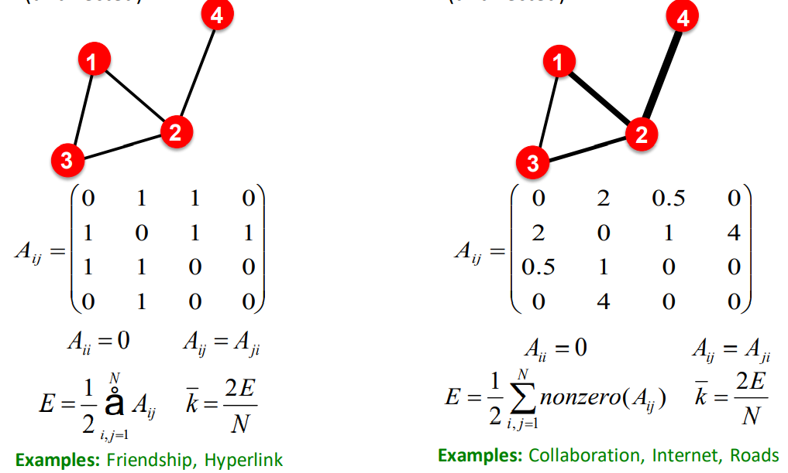

# Introduction of Graphic Neural Networks

**Networks are complex**

1. Arbitrary size and complex topological structure. (No spatial locality like grids)
2. No fixed point ordering or reference point, there is no fixed node ordering allow us to do. (left and right in sequence data, up and down in image data)
3. Often dynamic and have multi modal features.

## Application

### Node level: Protein folding

Nodes: Amino acids in a protein sequence

Edges: Proximity between amino acids (residues)

Goals: Possible 3D structural of protein

### Edge level: Recommender systems

Nodes: Users and items

Edges: User-item interactions

Goals: Recommend items users might like

### Edge level: Drug side-effect

Nodes: Drugs or Proteins

Edges: Interactions

Query: How likely will Simvastatin and Ciprofloxacin, when taken together?

In the above two level heterogeneous network, the circles are proteins in our body, the triangles are the different drugs. The way drugs works is that they target the different proteins.

### Subgraph: Traffic prediction

Nodes: Road segments

Edges: Connectivity between road segments

### Graph level: Drug Discovery

Nodes: Atoms

Edges: Chemical bonds

Query: Which molecules could therapeutic effect, or which molecules should be prioritized so that biologists can pass them in the lab t validate.

### Graph level: Physics Simulation

Nodes: Particles

Edges: Interaction between particles

Steps of iteration

1. Take the material and represent it as a set of particles, based on the proximity (interaction between particle), we generate the proximity graph.
2. Apply Graph neural network that takes current properties  (positions, velocities), and predict the future properties.
3. Based on above prediction, we can evolve the particle to the new position. Then back to step 1.

## Choice of graph representation

###　Component of graph

Objects: Nodes, vertices,  $N$

Interactions: Links, edges, $E$

Systems: network, graph, $G(N,E)$

### Directed Graphs and Undirected Graphs

###  Node Degrees

$k_i$: the number of edged adjacent to node $i$

$k_A = 4$

Average degree $\bar{k} = <k> = \frac{1}{N} \sum\limits_{i=1}^{N}k_i = \frac{2E}{N}$

In directed networks we define an in-degree and out-degree. The total degree of a node is the sum of in and out degrees.

$k^{in}_C= 2， \;  k^{out}_C = 1,   \;   k_C = 3,   \;  \bar{k} = \frac{E}{N},\; \overline{k^{in}} = \overline{k^{out}}$

### Bipartite Graph

Which is a graph whose nodes can be divided into two disjoint sets $U$ and $V$, where nodes only interact with the other type of node, but not with each other.

### Adjacency Matrix

$$
A_d = \left[\begin{array}{ccc}
0 & 1 & 0 & 1\\
1 & 0 & 0 & 1\\
0 & 0 & 0 & 1\\
1 & 1 & 1 & 0
\end{array}\right]
A_{ud} = \left[\begin{array}{ccc}
0 & 0 & 0 & 1\\
1 & 0 & 0 & 0\\
0 & 0 & 0 & 0\\
0 & 1 & 1 & 0
\end{array}\right]
$$
Most networks are sparse $E << E_{max}; k << N-1$

### Edge List

Represent graph as a list of edges

$(2, 3), (2, 4), (3,2), (3, 4), (4, 5), (5, 2), (5, 1)$

### Weighted and Unweighted Graph

### Self-edges and Multigraph

self edge provide 2 extra degree.

### Connectivity of Undirected Graph

For undirected graph, connected meaning any two vertices can be joined by a path. A disconnected graph is made up by two or more connected components.

### Connectivity of Directed Graph

**Strongly connected directed graph**

has a path from each node to every other node and vice versa.

**Weakly connected directed graph**

is connected if we disregard the direction

