# 1. Tradition Methods for Machine Learning in Graphs

##  Traditional ML Pipeline

1. Design features for nodes/links/graphs

2. Obtain features for all training data

traditional machine learning pipelines use hand-designed, handcrafted features

## Machine Learning in Graphs

**Goal**: Make predictions for a set of objects

**Design choices** 

Features: d-dimensional vectors

Objects: nodes, edges, sets of nodes, entire graphs

Object function: What task are we aiming to solve?

Method 1:

Given a graph as a set of vertices  and a set of edges, we want to learn a function for every node will five us a real values prediction.

Given $G = (V, E)$, Learn a function $f: V\rightarrow \R$

# 2. Node-Level Tasks and Features

## 2. 1 Node classification

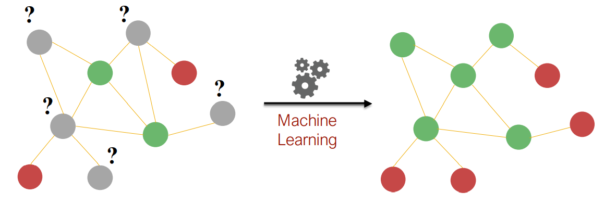

The goal is predict the colors of uncolored nodes.

Given the red and green nodes, we want to colorize the gray node. The rule is green node should have at least two edges adjacent to them, red node have exactly one edge connected to them.

If we are now able to describe the node degree of every node as a structural feature in this graph. Then we will be able to learn the model.

 ## 2. 2 Overview

Goal: Characterize the structure and position of a node in the network:

1. Node degree
2. Node centrality
3. Clustering coefficient
4. Graphlets

## 2.3 Node features : Node degree

The degree $k_v$ of node $v$ is the number of edges (neighboring node) the node has.

Treats all neighboring nodes equality.

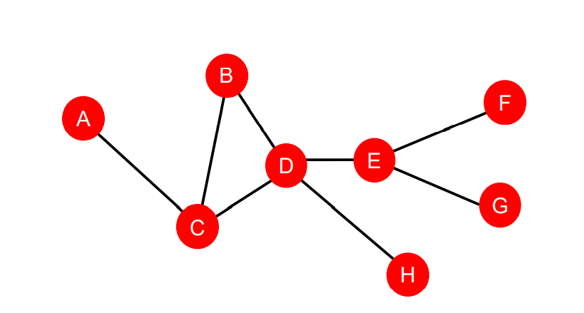

$k_A = 1; k_b = 2; k_C = 3; k_D = 4; k_E = 3; k_F = 1; k_G = 1; k_H = 1$

**Summarize**

1. Node degree counts the neighboring nodes without capturing their importance
2. Node centrality $c_v$ takes the node importance in a graph into account
3. Different Ways to model importance:
   1. Eigenvector centrality
   2. Betweenness centrality
   3. Closeness centrality
   4. and many others

### 2.3.1 Eigenvector centrality

A node $v$ is import if surrounded by important neighboring nodes $u\in N(v)$

sum all of the importance  neighbors and over a constant number.
$$
c_v = \frac{1}{\lambda} \sum\limits_{u\in N(v)}c_u \Longleftrightarrow \bold{\lambda}c = \bold{A}c
$$
$\lambda$ is some positive constant, $\bold{A}$ is Adjacency matrix $\bold{A}_{uv} = 1$ if $u\in N(v)$

$\bold{c}$ is Centrality vector

The largest eigenvalue $\lambda_{max}$ is always positive and unique (Perron-Frobenius Theorem)

The leading eigenvector $\bold{c}_max$ is used for centrality.

It is not about how many connections of node have but it is about who these connections point to and how important.

### 2.3.2 Betweenness centrality

A node is important if it lies on many shortest paths between other nodes.

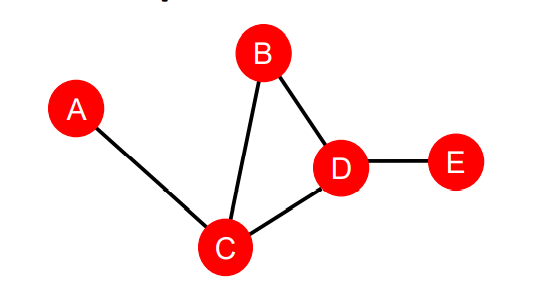
$$
c_v = \sum\limits_{s\neq v \neq t}\frac{\#(short\;pathes\;between\;s\;and\;t\;that\;contain\;v)}{\#(shortest\;paths\;between\;s\;and\;t)}
$$

$c_A = c_B = c_E = 0$

$c_C = 3; A-C-B, A-C-D, A-C-D-E$

$c_D = 3; A-C-D-E, B-D-E,C-D-E$

### 2.3.3 Closeness centrality

A node is important if it has small shortest path lengths to all other nodes
$$
c_v = \frac{1}{\sum\limits_{u\neq v} shortest\;path\;length\;betweem\;u\;and\;v}
$$
Node pairs among $k_v$ neighboring nodes

$c_A = \frac{1}{2 + 1 + 2 + 3} = \frac{1}{8}; A-C, A-C-B, A-C-D, A-C-D-E$

$C_D = \frac{1}{1 + 1 + 1 + 2} = \frac{1}{5}; D-E, D-B, D-C, D-C-A$

the more central you are, the shorter the path to everyone else. Meaning node is more important

## 2.4 Node Features: Clustering Coefficient

Measures how connected v’s neighboring nodes are:
$$
e_v = \frac{\#(edges\;among\;neighboring\;nodes)}{\binom{k_v}{2}} \in [0, 1], k_v = node\;degree
$$
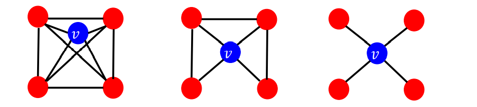
$$
e_v = \frac{6}{6} = 1; e_v = \frac{3}{6} = \frac{1}{2}; e_v = \frac{0}{6} = 0
$$

## 2.5 Node Features: Graphlets

Clustering coefficient counts the triangles in the ego-network

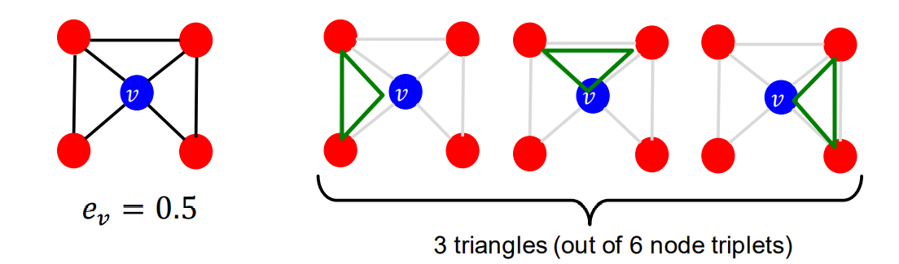

Ego-network: It is include by the node itself and its neighbors. It is basically degree 1 neighborhood network around a given node.

Triangle: If we have a ego-network, we can count how many triples of nodes are connected.

**Graphlets**: Rooted connected non-isomorphic subgraphs

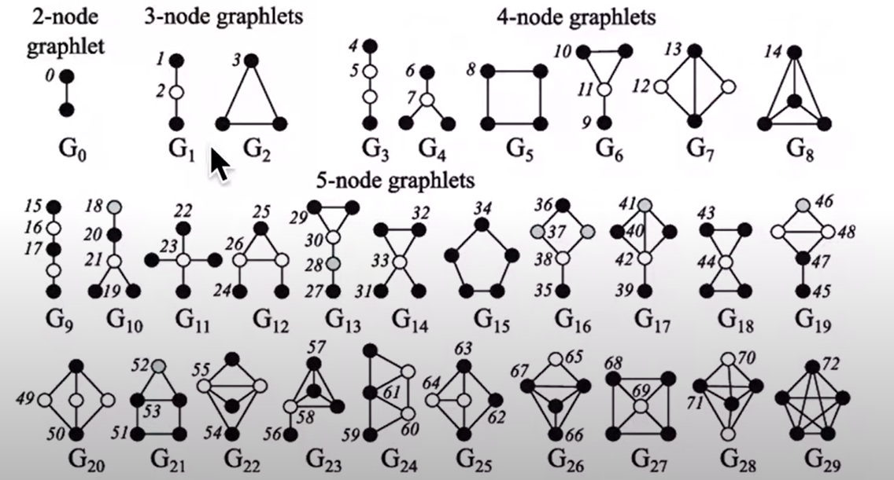

**Graphlet Degree Vector (GDV)**: Graphlet-base features for nodes.

**Degree**: counts edges that a node touches

**Clustering coefficient**: counts triangles that a node touches

**GDV**: counts graphlets that a node touches

**Example of Graphlet Degree Vector (GDV)**: A count vector of graphlet rooted at a given node.

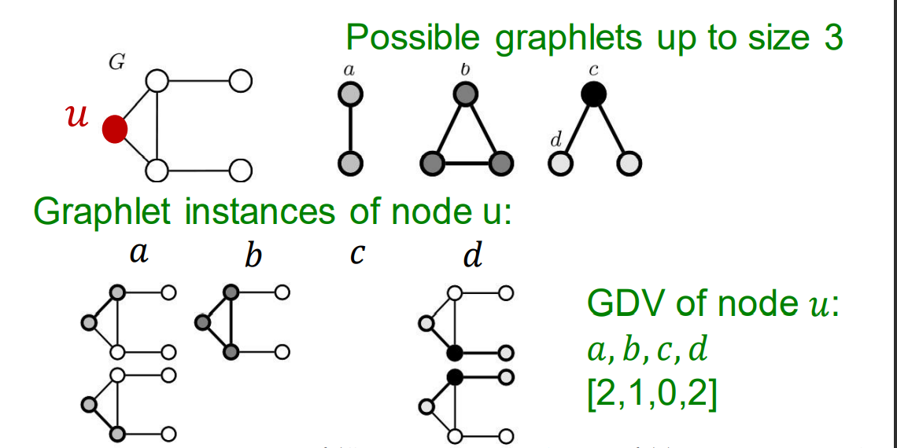

Considering graphlets on 2 to 5 nodes we get:

1. Vector of 73 coordinates is a signature of a node that describes the topology of node’s neighborhood
2. Captures its interconnectivities out to a distance of 4 hops

Graphlet degree vector provides a measure of a node’s local network topology:

1. Comparing vectors of two nodes provides a more detailed measure of local topological similarity than node degrees or clustering coefficient

# 3. Link Prediction Task and Features

The task is to predict new links based on existing links.

At test time, all node pairs (no existing links) are ranked, and top K node pairs are predicted.

The key is to design features for a pair of nodes.

Two formulations of the link prediction task:

1. Link missing at random: Remove a random set of links and then aim to predict them

2. Links over time:

   2.1 Given $G[t_0, t_0^{'}]$ a graph on edges up to time $t_0^{'}$, output a ranked list $L$ of links (not in $G[t_0, t_0^{'}]$) that are predicted to appear in $G[t_1, t_1^{'}]$

   2.2 Evaluation: $n = |E_{new}|$, new edges that appear during the test period $[t_1, t_1^{'}]$; Take top n elements of L and count correct edges.

Links over time example: citation network, social networks, and collaboration networks.

## 3.1 Link Prediction via Proximity

**Methodology**

1. For each pair of nodes $(x, y)$ compute score $c(x, y)$
2. Sort pairs $(x, y)$ by the decreasing score $c(x, y)$
3. Predict top n pairs as new link
4. See which of these links actually appear in $G[t_1, t_1^{'}]$

## 3.2 Link-Level Features: Overview

Distance-based feature

Local neighborhood overlap

Global neighborhood overlap

### 3.2.1 Distance-based feature

**Shortest-path distance between two nodes**

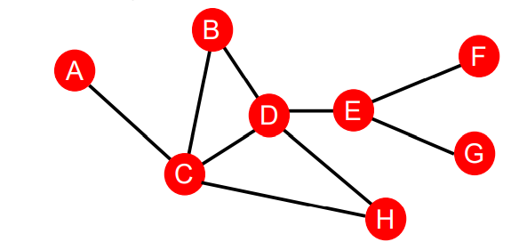

$S_{BH} = S_{BE} = S_{AB} = 2; S_{BG} = S_{BF} = 3$

This can only measure the distance, but does not capture the degree of neighborhood overlap. Node pair $(B, H)$ has 2 shared neighboring nodes, which pairs$(B, E)$ and $(A, B)$ only have 1 such node.

### 3.2.2 Local neighborhood overlap

Captures neighboring nodes shared between two nodes $v_1$ and $v_2$

Common neighbors
$$
\Large |N(v_1) \cap N(v_2)|
$$
Jaccard’s coefficient: 
$$
\Large\frac{N(v_1)\cap N(v_2)}{N(v_1)\cup N(v_2)}
$$
Adamic-Adar index: 
$$
\Large \sum\limits_{u\in N(v_1)\cap N(v_2)}\frac{1}{log(k_u)}
$$
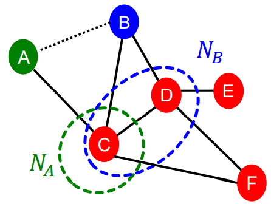

Common neighbors: $|N(v_1) \cap N(v_2)| = |\{C\}| = 1$

Jaccard’s coefficient: $\frac{N(v_1)\cap N(v_2)}{N(v_1)\cup N(v_2)}= \frac{|\{C|}{|\{C, D\}|} = \frac{1}{2}$

Adamic-Adar index: $\frac{1}{log(k_C)} = \frac{1}{log(4)}$

## 3.3 Global Neighborhood Overlap

### 3.3.1 Limitation of local neighborhood features

Metric is always zero if the two nodes do not have any neighbors in common. However, the two nodes may still potentially be connected in the future.

Global neighborhood overlap metrics resolve the limitation by considering the entire graph

### 3.3.2 Katz Index

Count the number of paths of all lengths between a given pair of nodes.

We can use power of graph adjacency matrix.

Recall $\bold{A}_{uv} = 1$ if $u\in N(v)$

Let $\bold{P}^{(K)}_{uv}$ paths of length $\bold{K}$ between $\bold{u}$ and $\bold{v}$

We will show $\bold{P}^{(K)} = \bold{A}^k$

$\bold{P}^{(1)}_{uv}$ paths of length 1 between $u$ and $v$, where $ \bold{P}^{(1)}_{uv}= \bold{A}_{uv}$

 **Compute $\bold{P}^{(2)}_{uv}$**

1. compute paths of length 1 between each of u neighbor and v
2. sum up these paths across u’s neighbors
   $\bold{P}^{(2)}_{uv} = \sum\limits_{i}A_{ui}*P^{(1)}_{iv} = \sum\limits_{i} A_{ui}*A_{iv} = A^2_{uv}$

Katz index between $v_1$ and $v_2$ is calculated as sum over all path lengths
$$
\Large S_{v_1, v_2} = \sum\limits_{l=1}^{\infin}\beta^l\bold{A}^l_{v_1, v_2}, 0 < \beta < 1
$$
 $\beta$ is discount factor

Katz index matrix is computed in closed-form
$$
\Large S = \sum\limits_{i=1}^{\infin}\beta^i\bold{A}^i = (\bold{I} - \beta \bold{A})^{-1} - I
$$

## 3.4 Summary

### 3.4.1 Distance-based features

1. Uses the shortest path length between two nodes  but does not capture how neighborhood overlaps.

### 3.4.2 Local neighborhood overlap

1. Captures how many neighboring nodes are shared  by two nodes.
2. Becomes zero when no neighbor nodes are shared.

### 3.4.3 Global neighborhood overlap

1. Uses global graph structure to score two nodes.
2. Katz index counts #walks of all lengths between two  nodes.

# 4. Global-Level Features and Graph Kernels

**Goal**: we want features that characterize the structure of an entire graph

## 4.1 Kernel Methods

which widely used in ML and Graph-Level prediction

we design kernel instead of feature vectors.

1. Kernel $K(G, G^{'})\in \R$ measures similarity between data points
2. Kernel matrix $\bold{K} = (K(G, G^{'}))_{G, G^{'}}$ must always be positive semidefinite (has positive eigenvalues). Which measure the similarity between all pairs of data points.
3. There exists a feature representation $\phi(\cdot)$ such that $K(G, G^{'}) = \phi(G)^T\phi(G^{'})$
4. Once the kernel is defined, off-the-shelf ML model (kernel SVM) can be used to make prediction

Graph kernels: measure similarity between two graphs:

1. Graphlet Kernel
2. Weisfeiler-Lehman Kernel
3. Others (Random-walk kernel, Shortest-path graph kernel)

## 4.2 Graph Kernels Key Idea

**Goal**: Design graph feature vector $\phi(G)$

**Key Idea**: Bag-of-Words (BoW) for a graph

BoW simply uses the word count as features for documents (no ordering considered)

Naïve extension to a graph: Regard nodes as words.

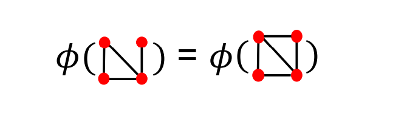

For above two graphs, they have the same representation by BoW, since they have the same nodes.

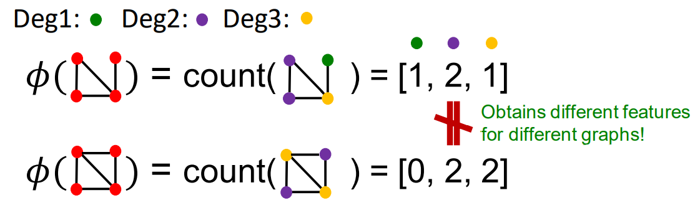

Both Graphlet Kernel and Weisfeiler-Lehman Kernel use Bag-of-* representation of graph.

## 4.3 Graphlet Kernel

Count the number of different graphlet in a graph

The Graphlet delimitation here is different than node-level features

1. Nodes in graphlets here do not need to be connected (allow for isolated nodes)
2. The graphlets here are not rooted

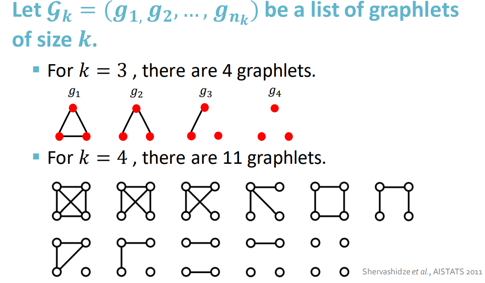

Given graph $G$, and a graphlet list $\mathcal{G} = (g_1, g_2, g_3, ..., g_{n_k}) $, define the graphlet count vector $f_G \in \R^{n_k}$ as 
$$
\Large (f_G)_i = \#(g_i \subseteq G) for \;i=1,2,...,n_k
$$
If k == 3:

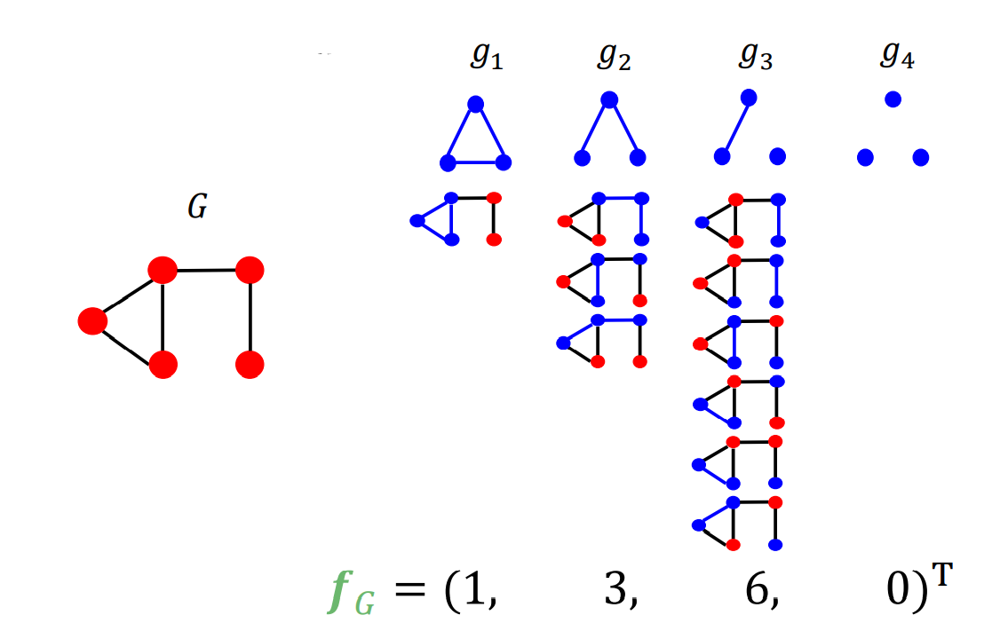

Given two graphs, $G$ and $G^{'}$, graphlet kernel is computed as $K(G, G^{'})$, graphlet kernel is computed as
$$
\Large K(G, G^{'}) = \bold{\mathcal{f}}_G^T\bold{\mathcal{f}}_{G^{'}}
$$
Problem: if $G$ and $G^{'}$ have different sizes, that will greatly skew the value.

Solution: Normalize each feature vector
$$
\Large h_G = \frac{f_G}{sum(f_G)}, K(G, G^{'}) = h_G^Th_{G^{'}}
$$
**Limitations**:

Counting size-k graphlets for a graph with size n by enumeration takes $n^k$.

This is unavoidable in the worst-case since subgraph isomorphism set is NP-hard. (judge whether a graph is a subgraph of another graph) 

If a graph's node degree is bounded by d, an $O(nd^{k-1})$ algorithm exists to count all the graphlets of size $k$.

## 4.4 Weisfeiler-Lehman Kernel

Goal: Design an efficient graph feature descriptor $\phi(G)$

Idea: Use neighborhood structure to iteratively enrich vocabulary. (generalized version of Bag-of-degrees since node degree are one-hop neighborhood information)

Algorithm to achieve this: Color refinement.

**Color Refinement**

Given: A graph $G$ with a set of nodes V.

Assign an initial color $c^{0)}(v)$ to each node $v$.

Iteratively refine node colors by:
$$
\Large c^{(k+1)}(v) = HASH(\{c^{(k)}(v), \{c^{(k)}(u)\}_{u\in N(v)}\})
$$
where HASH maps different inputs to different colors.

After $K$ steps of color refinement, $c^{(k)}(v)$ summarizes the structure of $K$-hop neighborhood.

Examples

Assign initial colors

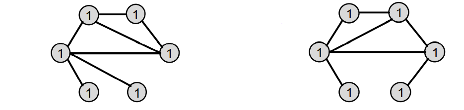

Aggregate neighboring colors

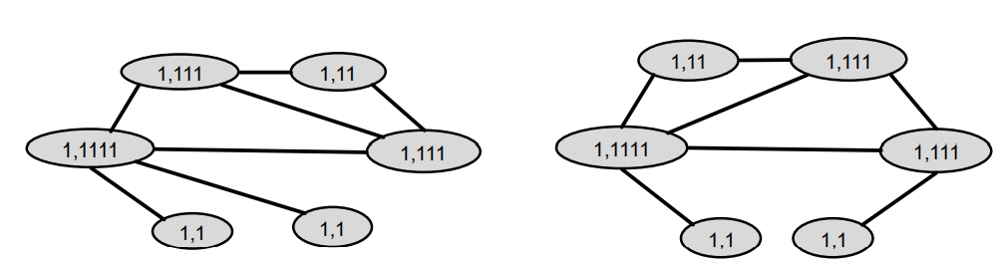

Hash aggregated colors

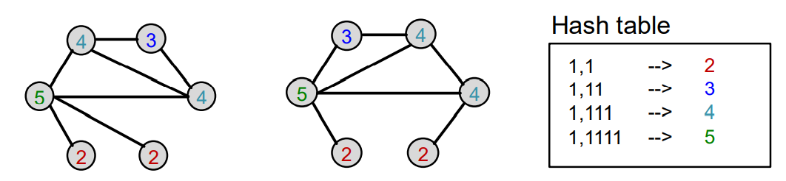

Aggregated colors

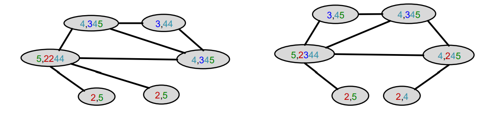

Hash aggregated colors

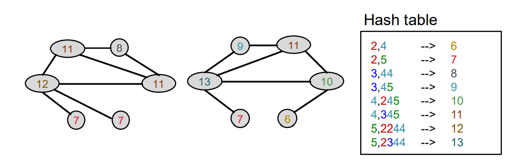

After color refinement, WL kernel counts number of nodes with a given color

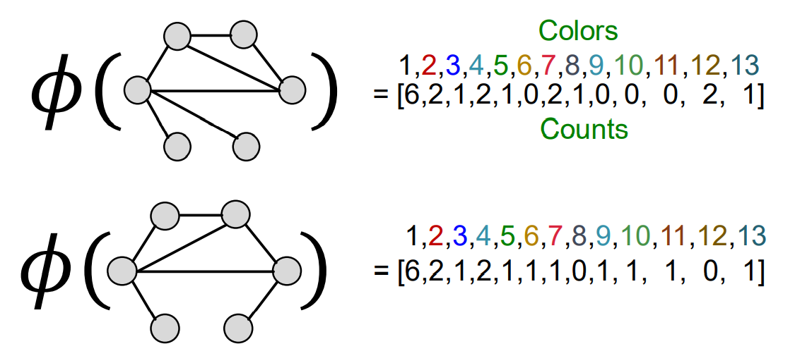

The WL kernel value is computed by the inner product of the color count vectors:

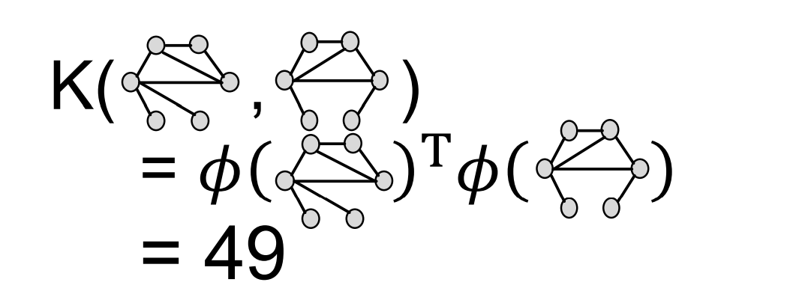

## 4.5 Weisfeiler-Lehman Kernel

WL Kernel is computationally efficient. The time complexity for color refinement at each step is linear in edges, since it involves aggregating neighboring colors.

When computing a kernel value, only colors appeared in the two graphs need to be tracked.

