# 1. Node embedding

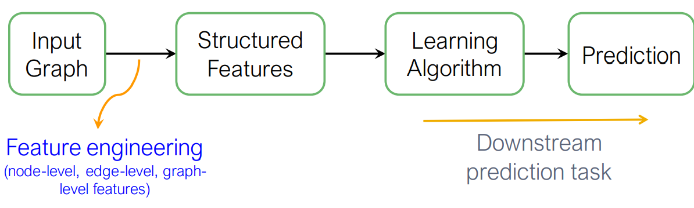

The idea behind graph representation learning is that we want alleviate manual feature engineering every single time or every single task. We want automatically learn the features.

**Goal**

Efficient task-independent feature learning for machine learning with graphs.

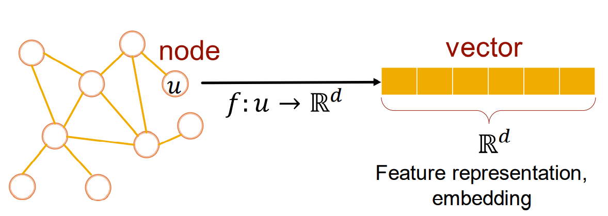

we want to learn how to map this node in a d-dimensional space and represent it as a vector of d numbers (embedding).

**Task**: map nodes into an embedding space

1. similarity of embeddings between nodes indicates their similarity in the network. (both nodes are close to each other)
2. Encode network information
3. Potentially used for many downstream predictions

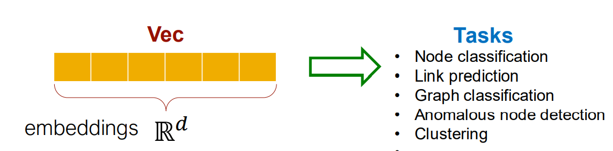

# 2 Node Embedding: Encoders and Decoders

## 2.1 Setup

Assume we have a undirect graph $G$

$V$ is the vertex set

$A$ is the adjacency matrix (assume binary)

For simplicity: no node features or extra information used

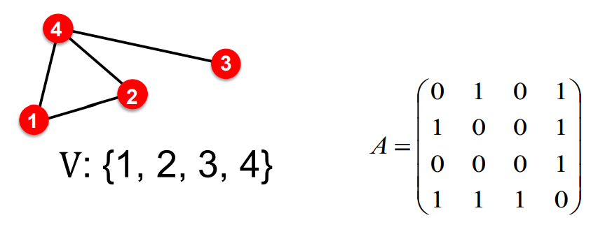

## 2.2 Node Embedding Goal

Encode nodes so that similarity in the embedding space approximates similarity in the graph.

we can use distance or dot product to approximate the similarity in the graph space.

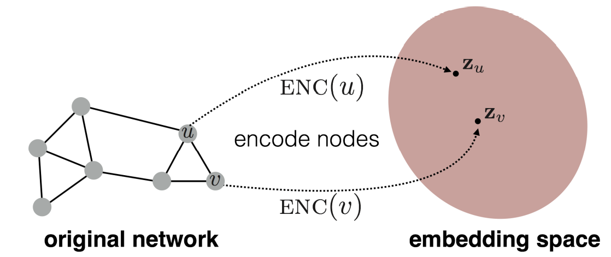
$$
similarity(u, v) \approx \bold{z}^T_v\bold{z}_u
$$
left is in the original network, right is in the embedding space

## 2.3 Learning Node Embedding

1. Encoder maps from nodes to embeddings
2. Define a node similarity function (A measure of similarity in the original network)
3. Decoder maps from embeddings to the similarity score
4. Optimize the parameters of the encoder so that, $similarity(u, v) \approx \bold{z}^T_v\bold{z}_u$

**Encoder**: maps each node to low-dimensional vector
$$
ENC(v) = \bold{z}_v
$$
v: node in the input graph

$\bold{v}$: d-dimensional embedding

**similarity function**: specifies how the relationships in vector space map to the relationships in the original network

**Decoder**: $similarity(u, v) \approx \bold{z}^T_v\bold{z}_u$

Simplest encoding approach: Encoder is just an embedding-lookup
$$
ENV(v) = \bold{z}_v = \bold{Z}\cdot v
$$
$\large \bold{Z} \in \R^{d\cross |v|}$: Matrix, each column is a node embedding [what we learn]

$\large v \in \mathbb{I}^{|V|}$: Indicator vector, all zeros except a one in column indicating node v

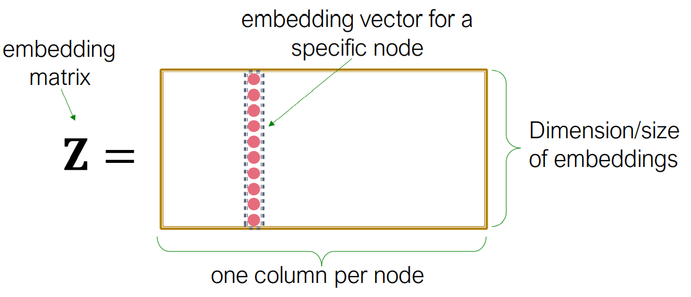

example:
$$
\bold{Z} = \begin{bmatrix}v_{1,1}, ..., v_{1,n-3}, v_{1,n-2}, v_{1,n-1}, v_{1,n}\\
											...\\
											v_{d,1}, ..., v_{d,n-3}, v_{d,n-2},v_{d,n-1},v_{d,n}\end{bmatrix}
											
											V = \begin{bmatrix} 0\\0\\...\\ 1\\0\\0\end{bmatrix}
$$
for node vector v, the embedding is $[v_{d,1}, ..., v_{d,n-3}, v_{d, n-2}, v_{d,n-1}, v_{d,n}]$

Each node is assigned a unique embedding vector (we directly optimize the embedding of each node)

Methods: DeepWalk, node2vec

## 2.4 Summary

Encoder + Decoder Framework

1. Shallow encoder: embedding lookup
2. Parameters to optimize: $\bold{Z}$ which contains node embeddings $\bold{z}_u$ for all nodes $u\in V$

Decoder: based on node similarity

Objective: maximize $\bold{z}^T_v\bold{z}_u$ for node pairs $(u, v)$ that are similar

Problem: How to define similarity

1. linked
2. share neighbors
3. similar structural roles

This is unsupervised/self-supervised way of learning node embeddings

1. we are not utilizing node labels and node features
2. The goal is to directly estimate a set of coordinates (embedding) of a node so that some aspect of the network structure (capture by Decoder) is preserved
3. These embeddings are task independent, they are not trained for a specific task but can be used for any task.

# 3. Random Walk Approaches for Node Embeddings

## 3.1 Notion

**Vector $\bold{z}_u$**

The embedding of node u (we aim to find)

**Probability $P(v\mid \bold{z}_u)$**

The predicted probability of visiting node v on random walks starting from node u

**SoftMax function**
$$
\Large \sigma(z)_i = \frac{e^{z_i}}{\sum\limits_{j=1}^Ke^{z_j}}
$$
**Sigmoid function**
$$
\Large S(x) = \frac{1}{1 + e^{-x}}
$$

## 3.2 Random Walk

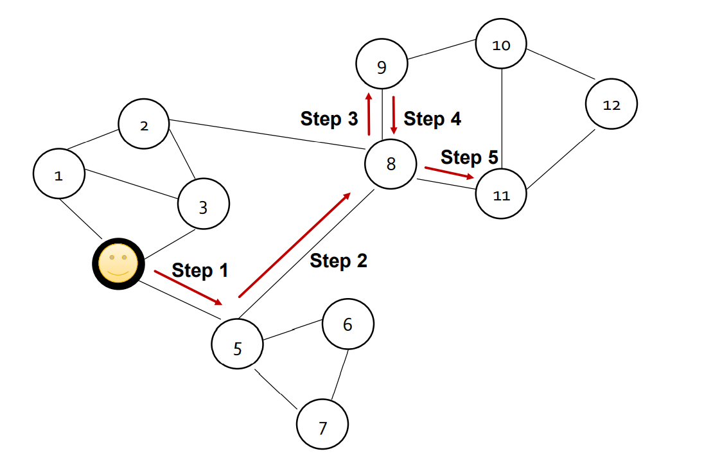

Given a graph and a starting point, we select a neighbor of it at random, and move to this neighbor; then we select a neighbor of this point at random, and move to it, etc.

The random sequence of points visited this way is a random walk on the graph.

$\bold{z}_u^T\bold{z}_v \approx$ probability that $\bold{u}$ and $\bold{v}$ co-occur on a random walk over the graph.

## 3.3 Random Walk Embeddings

1. Estimate probability of visiting node v on a random walk starting from node u using some random walk strategy R

2. Optimize embeddings to encode these random walk statics: 

   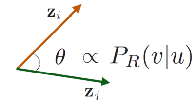

Pros:

1. Expressivity: Flexible stochastic definition of node similarity that incorporates both local and higher order neighborhood information. if random walk starting from node u visits node v with high probability, u and v are similar.
2. Efficiency: Do not need to consider all node pairs when training; only need to consider pairs that co-occur on random walks.

## 3.4 Unsupervised Feature Learning

Intuition: Find embedding of nodes in d-dimensional space that preserves similarity

Idea: Learn node embedding such that nearby nodes are close together in the network

Given a node u, how do we define nearby nods: $N_R(u)$ neighborhood of u obtained by some random walk strategy R.

## 3.5 Feature Learning as Optimization

Given $G = (V,E)$

Our goal is to learn a mapping $f:u\rightarrow\mathbb{R}^d: f(u) = \bold{z}_u$

Log-likelihood objective:
$$
\large \max\limits_{f}\sum\limits_{u\in V}log P(N_R(u)\mid \bold{z}_u)
$$

$N_R(u)$ is the neighborhood of node u by strategy R.

Given node u we want to learn feature representations that are predictive of the nodes in its random walk neighborhood $N_R(u)$.

How to do that?

1. Run **short fixed-length random walks** starting from each node u in the graph using some random walk strategy $R$.
2. For each node u, collect $N_R(u)$, the multiset of nodes visited on random walks starting from u. (Node can be visit multi times)
3. Optimize embeddings according to: Given node u, predict its neighbors $N_R(u)$.

$$
\large \max\limits_{f}\sum\limits_{u\in V}log P(N_R(u)\mid \bold{z}_u)
$$

Equivalently,
$$
\large \mathcal{L} = \sum\limits_{u\in V}\sum\limits_{v\in N_R(u)} -log(P(v\mid \bold{z}_u))
$$
Intuition: Optimize embeddings $\bold{z}_u$ to maximize the likelihood of random walk co-occurances

Parameterize the $p(v\mid \bold{z}_u)$
$$
\large P(v\mid \bold{z}_u) = \frac{e^{\bold{z}_u^T\bold{z}_v}}{\sum\limits_{n\in V}e^{\bold{z}^T_u\bold{z}_n}}
$$
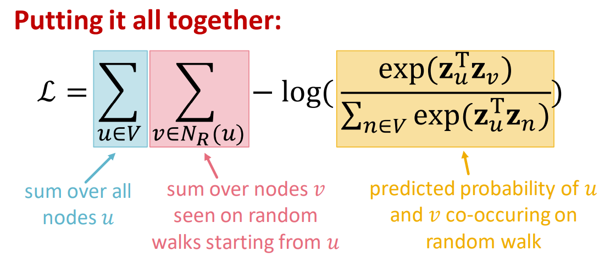

Optimize random walk embeddings = Finding embeddings $\bold{z}_u$ that minimize $\mathcal{L}$

Problem: In practice, the above computational complexity for above equation is $O(|V|^2)$

Solution: Negative sampleing

$$
\large log(\frac{e^{\bold{z}_u^T\bold{z}_v}}{\sum\limits_{n\in V}e^{\bold{z}_u^T\bold{z}_n}}) \approx log(\sigma(\bold{z}^T_u\bold{z}_v)) - \sum\limits_{i=1}^{k}log(\sigma(\bold{z}_u^T\bold{z}_{n_i})), n_i \sim P_V
$$
$n_i \sim P_v$ : random distribution over nodes, we sampled at random, not at uniform random, but random with a biased way.

Sample $k$ negative nodes each with probability, proportional to its degree.

Two consideration for k (negative samples):

1. Higher k gives more robust estimates
2. Higher k corresponds to higher bias on negative events

In practice k = 5-20

## 3.6 Stochastic Gradient Descent

After we obtained the objective function, how do we optimize (minimize) it?
$$
\large \mathcal{L} = \sum\limits_{u\in V}\sum\limits_{v\in N_R(u)} -log(P(v\mid \bold{z}_u))
$$
Gradient Descent:

1. Initialize $\bold{z}_i$ at some randomized value for all i

2. Iterate until convergence

   2.1 For all i, compute the derivative $\frac{\partial \mathcal{L}}{\partial z_i}$

   2.2 For all i, make a step towards the direction of derivative: $z_i \leftarrow z_i - \eta \frac{\partial \mathcal{L}}{\partial z_i}$

Stochastic Gradient Descent:

Evaluate it for each individual training example.

1. Initialize $\bold{z}_i$ at some randomized value for all i

2. Iterate until convergence: $\mathcal{L}^{(u)} = \sum\limits_{v\in N_R(u)}-log(P(v\mid \bold{z}_u))$

   2.1 Sample a node i, for all j calculate the derivate $\frac{\partial \mathcal{L}^{(i)}}{\partial z_j}$

   2.2 For all j, update: $z_j \leftarrow z_j - \eta \frac{\partial \mathcal{L}^{(i)}}{\partial z_j}$

## 3.7 Summary

1. Run short fixed-length random walks starting  from each node on the graph 
2. For each node 𝑢 collect $𝑁_𝑅(𝑢)$, the multiset of  nodes visited on random walks starting from $u$.
3. Optimize embeddings using Stochastic  Gradient Descent

$$
\large \mathcal{L} = \sum\limits_{u\in V}\sum\limits_{v\in N_R(u)} -log(P(v\mid \bold{z}_u))
$$

# 4. Node2vec

**Goal**: Embed nodes with similar network neighborhoods close in the feature space

We frame this goal as a maximum likelihood  optimization problem, independent to the  downstream prediction task. (fake task in NLP)

**Key observation**: Flexible notion of network  neighborhood $𝑁_𝑅(𝑢)$ of node 𝑢 leads to rich node  embeddings

Develop biased 2nd order random walk R to  generate network neighborhood $N_R(u)$ of node u.

## 4.1 Biased Walks

Use flexible, biased random walks that can trade off between local and global views of the network.

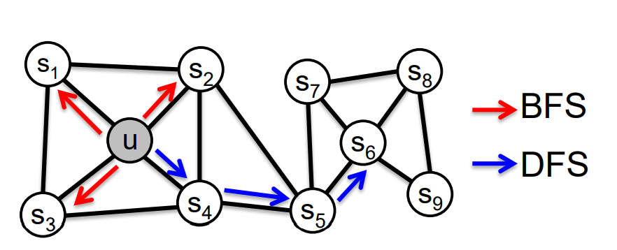

Two classic strategies to define a neighborhood $N_R(u)$ of a given node u:

assume $N_R(u)$ of size 3

$N_{BFS}(u) = \{s_1, s_2, s_3\}$, local microscopic view

$N_{DFS}(u) =\{s_4,s_5,s_6\}$, global macroscopic view

## 4.2 Interpolating BFS and DFS

Biased fixed-length random walk R that given a node u generates neighborhood $N_R(u)$

There are two hyper parameters

**Return parameter $p$**

1. return back to the previous node

**In-out parameter $q$**

1. moving outwards (DFS) vs inwards (BFS)
2. Intuitively, q is the ratio of BFS vs DFS

Biased 2nd order random walks  explore network neighborhoods:

1. Random walk just traversed edge $(s_1, w)$ and is now at w.
2. Insight: Neighbors of w can go to $s_1, s_2, s_3$

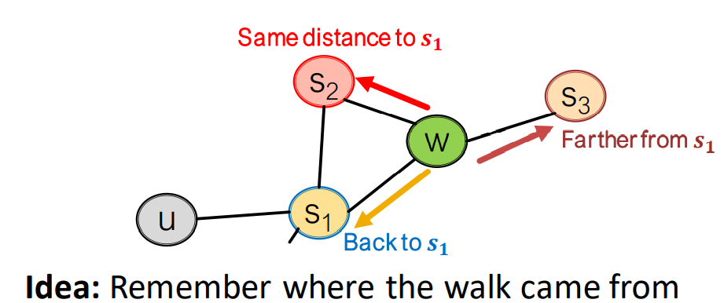

for a new graph, walker came over edge $(s_1, w)$ and is at w. where to go next?

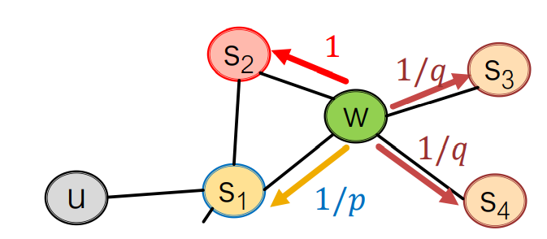

$\frac{1}{p}, \frac{1}{p}, 1$ are unnormalized probabilities.

p: return parameter; q: walk away parameter;

BFS-walk: low value of p

DFS-walk: low value of q

$$
\large W \rightarrow \begin{bmatrix} S_1\\S_2\\S_3\\S_4\end{bmatrix}_{target} \rightarrow \begin{bmatrix} \frac{1}{p}\\1\\\frac{1}{q}\\\frac{1}{q}\end{bmatrix}_{prob} \rightarrow  \begin{bmatrix} 0\\1\\2\\2\end{bmatrix}_{Dist}
$$

## 4.3 Algorithm

1. Compute random walk probabilities
2. Simulate r random walks of length $l$ starting from each node $u$
3. Optimize the node2vec objective using Stochastic Gradient Descent

**Pros**

Linear-time complexity and all steps are individually parallizable.

Cons:

we need to learn a separate embedding for every node.

## 4.4 Other Radom walk Ideas

Refer the original slide

## 4.5 Summary so far

**Core Idea**:

Embed nodes so that distances in embedding space reflect node similarities in the original networks.

**Different Notion of node similarity**

Naïve: similar if 2 nodes are connected

Neighborhood overlap

Random walk approaches

 # 5. Embedding Entire Graphs

Goal: Want to embed a subgraph or an entire graph G, graph embedding: $\bold{z}_G$

Tasks: 

1. Classifying toxic vs non-toxic molecules
2. Identifying anomalous graph

## 5.1 Approach

### 5.1.1 Approach 1

Run a standard graph embedding technique on the subgraph G.

Then just sum the node embeddings in the subgraph G.
$$
\large \bold{z}_G = \sum\limits_{v\in G}\bold{z}_v
$$

### 5.1.2 Approach 2

Introduce a “virtual node to represent the subgraph and run a standard graph embedding technique. (using virtual node’s embedding to represent whole graph embedding, apply random walk etc.)

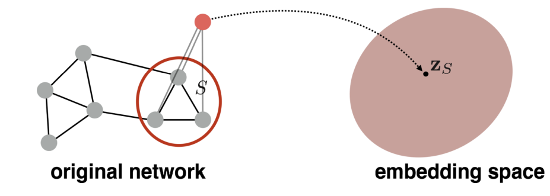

### 5.1.3 Approach 3: Anonymous Walk Embeddings

States in anonymous walks correspond to the index of the first time we visited the node in a random walk.

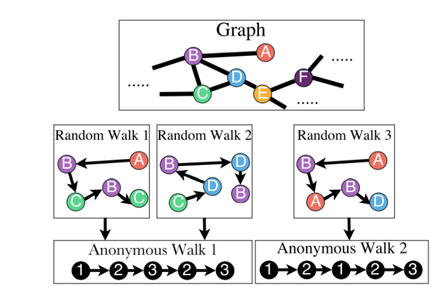

random walk 1: $A\rightarrow B \rightarrow C \rightarrow B \rightarrow C$

we assign 1, 2, 3 to A, B, C separately, because they appear one after another. Then we get:

$1 \rightarrow 2 \rightarrow 3$.

The next is B, but we met the B at the second movement, so we assign 2 to the anonymous walk. And assign 3 to anonymous walk finally.

## 5.2 Number of Walks Grows

if walks of length 3: 111, 112, 121, 122, 123

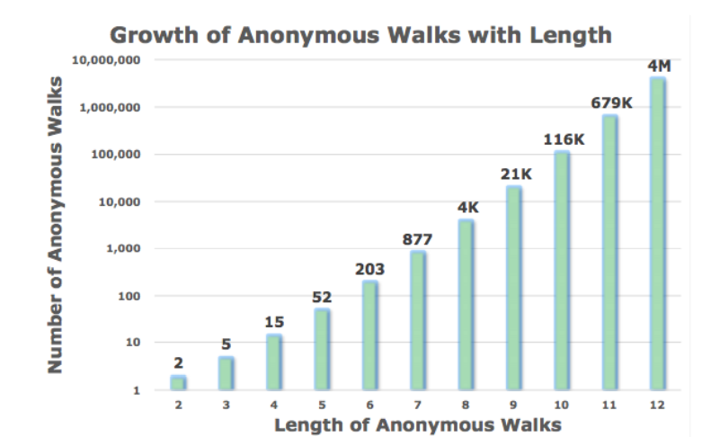

It grows with exponential.

Simulate anonymous walks $w_i$ of length l and record their counts. Represent the graph as a probability distribution over these walks.

Example:

$l = 3$

The graph can be represent to a 5-dim vector, because for $l=3$, we have 5 different anonymous walk way.

$\bold{Z}_G[i] = $ probability of anonymous walk $w_i$ in G.

## 5.3 Sampling Anonymous walks

Generate independently a set of m random walks

Represent the graph as a probability distribution over these walks.

we want the distribution to have error of more than $\epsilon$ with probability less than $\delta$:
$$
\large m = [\frac{2}{\epsilon^2}( log(2^{\eta} - 2) - log(\delta))]
$$
where $\eta$ is the total number of anonymous walks of length l.

## 5.4 Learn Walk Embeddings

A vector parameters $\bold{z}_G$ for input graph, the embedding for entire graph to be learned.

Starting from node1: Sample anonymous random walks.

Learn to predict walks that co-occur in $\Delta$-size window
$$
\large \max\sum\limits_{t =\Delta}^{T-\Delta} log(P(w_t\mid w_{t-\Delta},...,w_{t+\Delta}, \bold{z}_G))
$$
Sum the objective over all nodes in the graph.

Run $T$ different walks from $u$ each of length $l$: $N_R(u) = \{w_1^u,w_2^u,...,w_T^u\}$

Learn to predict walks that co-occur in $\Delta$-size window

Estimate embedding $z_i$ of anonymous walk $w_i$. Let $\eta$ be number of all possible walk embeddings.

Objective:
$$
\large \max\limits_{Z, d} \frac{1}{T}\sum\limits_{t=\Delta}^{T-\Delta}log P(w_t\mid \{w_{t-\Delta},...,w_{t+\Delta}, z_G\})
$$

$$
\large P(w_t\mid \{w_{t-\Delta},...,w_{t+\Delta}, z_G\})  = \frac{e^{y(w_t)}}{\sum\limits_{i=1}^{\eta}e^{y(w_i)}}
$$

$$
\large y(w_i) = b + U \cdot (cat(\frac{1}{2\Delta}\sum\limits_{i=-\Delta}^{\Delta}z_i, z_G))
$$

The cat inside function means an average of anonymous walk embeddings in window. Then concatenated with the graph embedding $z_G$

$b\in \R\in \R^D$ are learnable parameters

# 6. Summary

Approach 1

Embed nodes and sum/average them

Approach 2

Create super-node that spans the  (sub) graph and then embed that node. 

Approach 3

Anonymous Walk Embeddings

Idea 1: Sample the anon. walks and represent the  graph as fraction of times each anon walk occurs. 

Idea 2: Learn graph embedding together with  anonymous walk embeddings.

