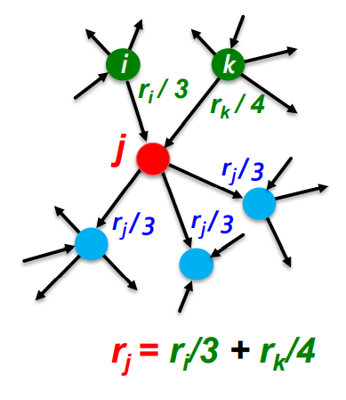
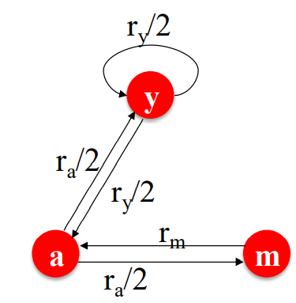
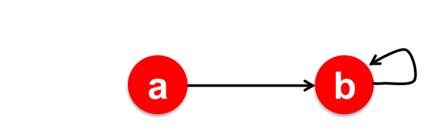
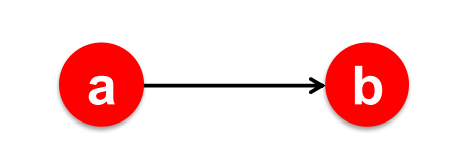
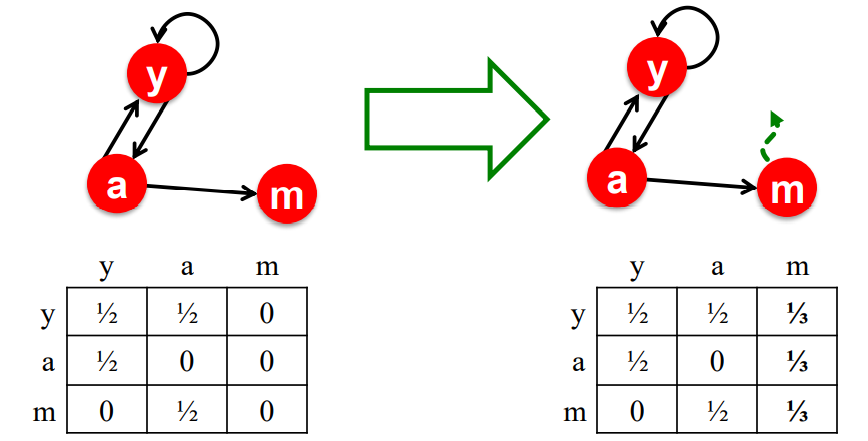
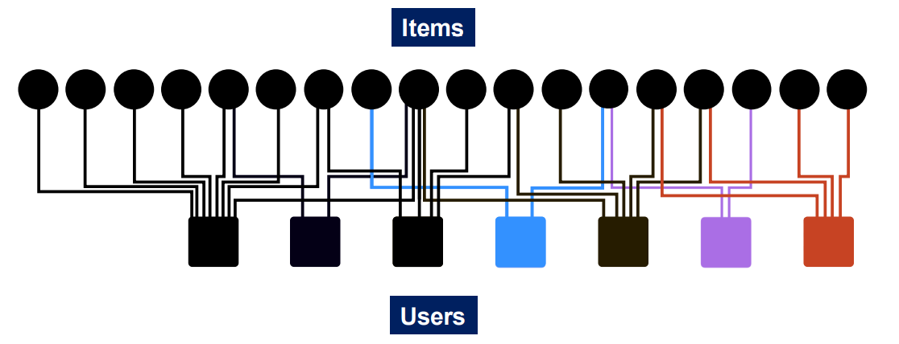

# Graph as Matrix: PageRank, Random Walks and Embeddings

Graph matrix allow us to:

1. Determine node importance via random walk
2. Obtain node embedding via matrix factorisation (MF)
3. View other node embedding (Node2Vec) as MF

## 1. PageRank

All web pages are not equally “important”, there is large diversity in the web-graph node connectivity. So we need rank the pages using the web graph **link structure**.

The commonly used to compute the importance of nodes in a graph:

1. PageRank
2. Personalised PageRank (PPR)
3. Random Walk with Restarts.

## 1.1 Idea of links as votes

Page is more important if it has more link. (In-coming link or out-coming link)

Links from important pages count more, so a “vote” form an important page is worth more.



Each link’s vote is proportional to the importance of its source page.

## 1.2 PageRank: The Flow Model

If page $i$ has importance $r_i$ and $d_i$ out-links. Each out-link gets $\frac{r_i}{d_i}$ votes. And the $r_i$ is equal to sum of the votes on its in-links.

Define rank $r_j$ for node $j$.
$$
\large r_j = \sum\limits_{i\rightarrow j} \frac{r_i}{d_i}
$$
$d_i ...$ out-degree of node $i$


$$
\large \begin{equation} \label{equation1}
\begin{split}
r_y & = \frac{r_y}{2} + \frac{r_a}{2} \\
 r_a    & = \frac{r_y}{2} + r_m \\
 r_m &= \frac{r_a}{2}
\end{split}
\end{equation}
$$

## 1.3 PageRank: Matrix Formulation

### 1.3.1 Stochastic adjacency matrix M

$d_i$ is the out degree of node $i$

if $i\rightarrow j$, then $M_{ji} = \frac{1}{d_i}$, $M$ is a column stochastic matrix, columns sum to 1.

**Rank Vector r**: An entry per page, $r_i$ is the importance score of page $i$, $\sum\limits_{i}r_i = 1$

The 1.2 flow equations can be written
$$
\large r = M \cdot r, \;\;\;r_j = \sum\limits_{i\rightarrow j} \frac{r_i}{d_i}
$$
rewrite above model to $r = M \cdot r$ form:
$$
\large \begin{bmatrix}r_y \\ r_a \\ r_m \end{bmatrix} = \begin{bmatrix}\frac{1}{2} &\frac{1}{2}&0 \\ \frac{1}{2}&0&1 \\ 0&\frac{1}{2}&0 \end{bmatrix}  \begin{bmatrix}r_y \\ r_a \\ r_m \end{bmatrix}
$$

### 1.3.2 connection to Random Walk

At time $t$, surfer is on page $i$, at time $t+1$, the surfer follows a out-link form $i$ uniformly at random. Ends up on some page $j$ linked from $i$, Process repeats indefinitely.

$p(t)$ is vector whose $ith$ coordinate is the probability. that the surfer is at page $i$ at time $t$. So the $p(t)$ is a probability distribution over pages.

### 1.3.3 Stationary Distribution

surfer position at time $t+1$: 
$$
\large p(t+1) = M \cdot p(t)
$$
suppose a random walk reaches a state:
$$
\large p(t+1) = M \cdot p(t) = p(t)
$$
then $p(t)$ is stationary distribution of a random walk.

the above example satisfies $r = M \cdot r$, so $r$ is a stationary distribution for the random walk.

### 1.3.4 Eigenvector Formulation

the flow equation: $1 \cdot \bold{r} = \bold{M}\cdot\bold{r}$

so the $r$ is eigenvector and $1$ is eigenvalue for stochastic adjacent matrix $M$.


Starting from any vector $\bold{u}$, the limit $\bold{M}(\bold{M}(\bold{...M(\bold{Mu})}))$ is the long-term distribution of the surfers.

PageRank = Limiting distribution = principal eigenvector of M. If $\bold{r}$ is limit of the product $\bold{M...Mu}$, then $\bold{r}$ satisfies the flow equation $1 \cdot \bold{r} = \bold{M}\cdot\bold{r}$. 

The $\bold{r}$ is the principal eigenvector of $\bold{M}$ with eigenvalue 1.

This method is Power iteration, it is efficiently way to solve for $\bold{r}$

## 1.4 Summary for PageRank

Measure importance of nodes in a graph, using the link structure of the graph.

Stochastic matrix $\bold{M}$ is used for modelling surfer.

PageRank solves $\bold{r} = \bold{Mr}$ where $\bold{r}$ can be viewed as both the principle eigenvector of $\bold{M}$  and as the stationary distribution of a random walk over the graph.


## 1.5 Solve PageRank

Given a graph with n nodes, we use an iterative procedure:

1. Assign each node an initial page rank

2. Repeat until convergence
   $$
   \sum\limits_{i}\mid r^{t+1}_{i} - r^t_i\mid < \epsilon
   $$
   Calculate the PageRank of each node
   $$
   r_j^{t+1} = \sum\limits_{i\rightarrow j}\frac{r^t_i}{d_i}
   $$


## 1.6 Power Iteration Method

Initialize:
$$
\bold{r}^0 = [\frac{1}{N},\frac{1}{N},...,\frac{1}{N}]^T
$$
Iterate:
$$
\bold{r}^{t+1} = \bold{M} \cdot \bold{r}^t
$$
Stop when:
$$
\mid \bold{r}^{t+1} - \bold{t}^t\mid_1 < \epsilon
$$
where $L_1$ norm is applied for convergence justification.

Example:


Initialize:
$$
\bold{r}^0 = [\frac{1}{3}\;\;\frac{1}{3}\;\;\frac{1}{3}]
$$

$$
\bold{r}^1 = \bold{M}\cdot\bold{r}^0 =  \begin{bmatrix}
\frac{1}{2} & \frac{1}{2} & 0 \\
\frac{1}{2} & 0 & 1 \\
0 & \frac{1}{2} & 0 
\end{bmatrix}  \begin{bmatrix}\frac{1}{3}\\\frac{1}{3}\\\frac{1}{3} \end{bmatrix} = 
\begin{bmatrix}  \frac{1}{3}\\\frac{1}{2}\\\frac{1}{6}\end{bmatrix}
$$

so that:
$$
\begin{bmatrix}  r_y\\r_a\\r_m\end{bmatrix} = 
\begin{bmatrix}  \frac{1}{3}\\ \frac{1}{3}\\ \frac{1}{3}\end{bmatrix}\rightarrow
\begin{bmatrix}  \frac{1}{3}\\ \frac{1}{2}\\ \frac{1}{6}\end{bmatrix}\rightarrow
\begin{bmatrix}  \frac{5}{12}\\ \frac{1}{3}\\ \frac{1}{4}\end{bmatrix}\rightarrow
\begin{bmatrix}  \frac{9}{24}\\ \frac{11}{24}\\ \frac{1}{6}\end{bmatrix}\rightarrow
\begin{bmatrix}  \frac{6}{15}\\ \frac{6}{15}\\ \frac{3}{15}\end{bmatrix}
$$
There are three question for PageRank:

1. Does this convergence
2. Does it converge to what we want
3. Are result reasonable

Two Problems:

1. Some pages are dead ends which have no out-links
2. All out-links are within the group (Spider traps).

### 1.6.1 Spider trap Problem


$$
\bold{M} = \begin{bmatrix} 0 & 0\\ 1 & 1\end{bmatrix}
$$

$$
\begin{bmatrix} r_a\\ r_b\end{bmatrix} = \begin{bmatrix}\frac{1}{2}\\\frac{1}{2} \end{bmatrix}\rightarrow
\begin{bmatrix}0\\1 \end{bmatrix}\rightarrow
\begin{bmatrix}0\\1 \end{bmatrix}\rightarrow
\begin{bmatrix}0\\1 \end{bmatrix}\rightarrow
\begin{bmatrix}0\\1 \end{bmatrix}
$$

### 1.6.2 Dead end Problem


$$
\bold{M} = \begin{bmatrix} 0 & 0\\ 1 & 0\end{bmatrix}
$$

$$
\begin{bmatrix} r_a\\ r_b\end{bmatrix} = \begin{bmatrix}\frac{1}{2}\\\frac{1}{2} \end{bmatrix}\rightarrow
\begin{bmatrix}0\\\frac{1}{2} \end{bmatrix}\rightarrow
\begin{bmatrix}0\\0 \end{bmatrix}\rightarrow
\begin{bmatrix}0\\0 \end{bmatrix}
$$

### 1.6.3 Spider Traps Solution (Teleport)

At each time step, the random surfer has two options.

1. With probability $\beta$, follow a link at random
2. With probability $1-\beta$, jump to a random page

Common value for $\beta$ is $0.8-0.9$

### 1.6.4 Dead Ends Solution

Follow random teleport links with total probability 1.0 from dead-ends.



### 1.6.5 Random Teleport

$$
\large r_i = \sum\limits_{i\rightarrow j} \beta \frac{r_i}{d_i} + (1 - \beta) \frac{1}{N}
$$

Google’s solution is:

1. With probability $\beta$, follow a link at random
2. With probability $1-\beta$, jump to some random page

$d_i$: out-degree of node $i$

The Google matrix $G$:
$$
\large G = \beta M + (1-\beta)[\frac{1}{N}]_{N\times N}
$$

## 1.7 Summary for PageRank

PageRank solves for $\bold{r} = \bold{Gr}$ and can be efficiently computed by power iteration of the stochastic adjacency matrix $G$

Adding random uniform teleportation solves issues of dead-end and spider-traps problems.


# 2. Random Walk with Restarts and PPR

PPR: Personalized PageRank

**Bipartite**: The graph whose vertices can be divided into two disjoint and independent set $U$ and $V$. A bipartite graph is a graph that does not contain any odd-length loop (That means there is no vertices between set $U$ element or between set $V$ element).

Given: A bipartite graph represent user and item interactions:



Goal: Proximity on graphs

What items should we recommend to a user who interact with item Q.

Intuition: if items Q and P are interacted by similar users, recommend P when user interact with Q.

PageRank:

1. Ranks node by “importance”
2. Teleports with uniform probability to any node in the network

Personalized PageRank:

1.  Ranks proximity of nodes to the teleport nodes $S$ 

For PageRank, the teleport nodes $S$ is whole graph nodes, for PPR, it is a sub-graph.

Proximity on graphs:
What is mode related item to item Q?
Teleport back to the starting node: $S = \{Q\}$

## 2.1 Random Walks

Idea

1. Every node has some importance
2. Importance gets evenly split among all edges and pushed to the neighbors

Given a set of ` QUERY_NODES`, we simulate a random walk:

1. Make a step to random neighbor and record the visit
2. With probability ALPHA, restart the walk at one of the `QUERY_NODES`
3. The nodes with the highest visit count have highest proximity to the `QUERY_NODES`

Pseudo code:

```
Alpha = 0.5
QUERY_NODES = {Q}

item = QUERY_NODES.sample_by_weight()
for i in range(N_STEPS):
	user = item.get_random_neighbor()
	item = user,get_random_neighbor()
	item.visit_count += 1
	if random() < ALPHA:
		item = QUERY_NODES.sample_by_weight().
```

 ## 2.2 Benefits

This “similarity” considers:

1. Multiple connections
2. Multiple paths
3. Direct and indirect connections
4. Degree of the node


## 2.3 Summary

### 2.3.1 PageRank

Teleports to any node

Nodes can have the same probability of the surfer landing:
$$
S = [0.1, 0.1,0.1,0.1,0.1,0.1,0.1,0.1,0.1,0.1]
$$

### 2.3.2 Topic-Specific PageRank aka Personalized PageRank

Teleports to a specific set of nodes

Nodes can have different probabilities of the surfer landing there:
$$
S = [0.1, 0.0, 0.0, 0.2 ,0.0, 0.0, 0.5, 0.0, 0.0, 0.2]
$$

### 2.3.3 Random Walk with Restarts

Topic-Specific PageRank where teleport is always to the same node
$$
S = [0, 0, 0, 0, 1,0, 0, 0, 0, 0]
$$


# 3. Summary

1. A graph is naturally represented as a matrix
2. We defined a random walk process over the graph
3. PageRank = Limiting distribution of the surfer location represented node improtance


 


 
