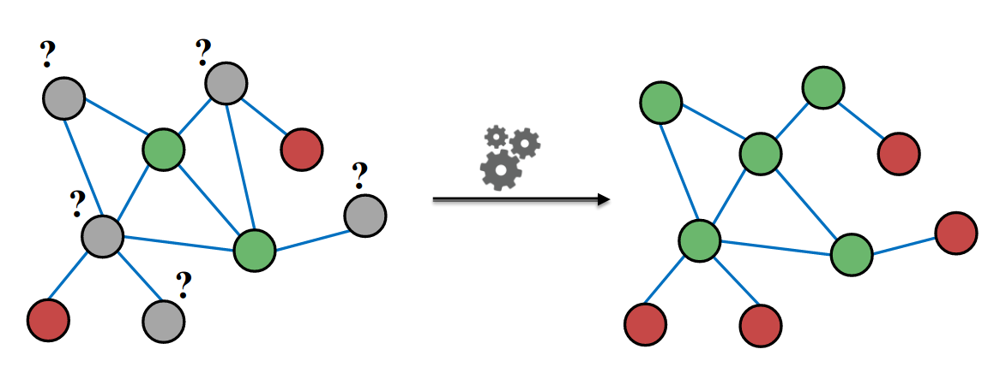

# Message Passing and Node Classification

**Example: Node classification**

Given labels of some nodes. Predict labels of unlabeled nodes. This is called semi-super sized node classification problem. The supervised signals and unsupervised signal are all provided at the same time.

**Question outline**

Given a network with labels on some nodes, how to assign labels to unlabeled nodes in the network. 

The solution is message passing

**Intuition**

Correlation exist in the network, which means similar node tends are connected. 

### Correlation in Network

In the graph, the nearby nodes have the same label.

Main type of dependencies that lead to correlation is  Homophily and Influence.

Homophily is a notion form social science, which means the people of similar characteristics tend to link each other .

Influence indicates the social connections influence people own characteristics or own behaviors. 

**Homophily**

The tendency of individuals to associate and bond with similar others. Researchers who forces on the same research area are more likely to establish a connection, such as meeting at conference, interacting in academic talks. 

**Influence**

Social connections can influence the individual characteristics of a person.

The next step is using Homophily and Influence observed in networks to help predict node labels.

Classification label of a node $v$ in network may depend on:

1. Feature of node $v$
2. Labels of the node $v's$ neighborhood
3. Features of the node $v's$ neighborhood

## Semi-supervised Learning 

**Given**: Graph and few labeled nodes

**Find**: class of remaining nodes

**Assumption**: There is some degree of homophily in the network.

**Application**

1. Document classification 
2. Part of speech tagging
3. Link Prediction
4. Optical character recognition

## Collective Classification

Simultaneous classification of interlinked nodes using correlations. The probabilistic framework is used.

**Markov Assumption** : the label $Y_v$ of one node $v$ depends on the labels of its neighbors $N_v$
$$
P(Y_v) = P(Y_v|N_v)
$$

**Main steps**

1. Local classifier: Assign initial labels
2. Relational Classifier: Capture correlations between nodes
3. Collective Inference: Propagate correlations through network

**Local classifier**

Predicts the label based on the node attributes or  features. It does not used any information from network.

**Relation classifier**

Learns a classifier to label one node based on the labels and/or attributes of its neighbors. It introduce the network information.

**Collective classifier**

Apply relational classifier to each node iteratively, until the inconsistency between neighboring labels is minimized (or to reach maximum iteration loop). Network structure affects the final prediction.

