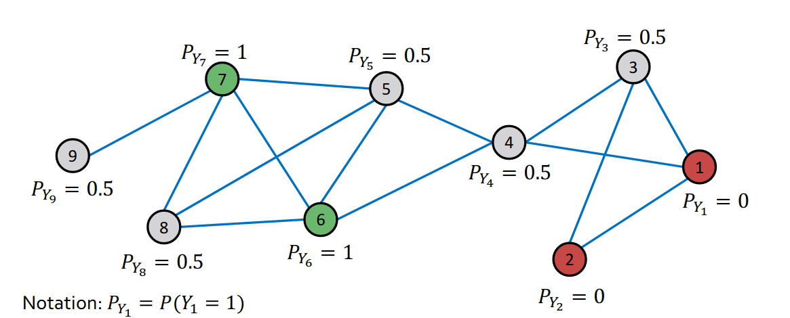
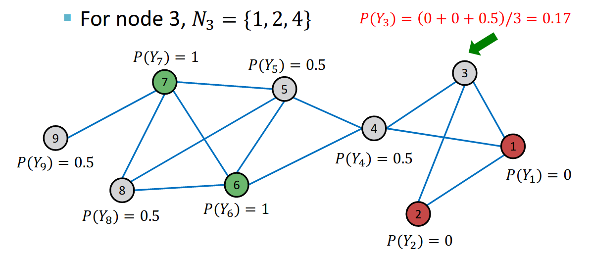
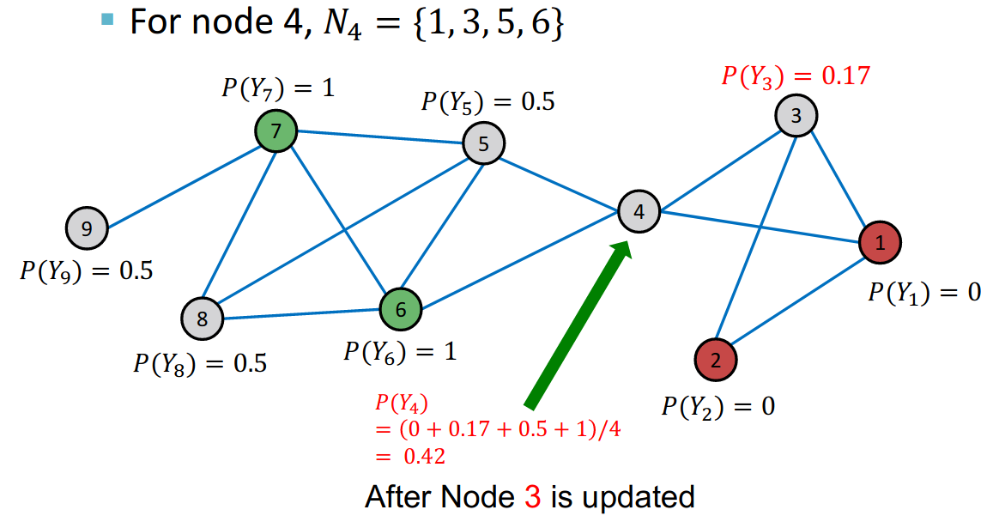
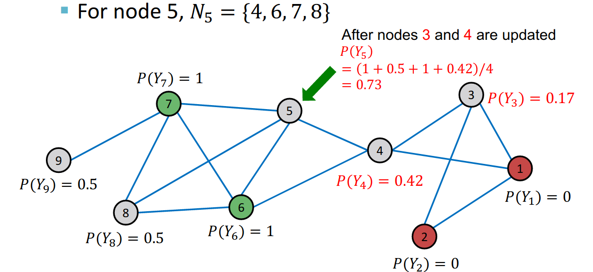
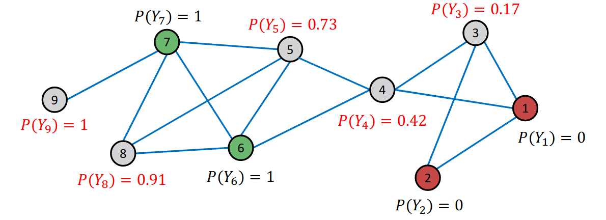
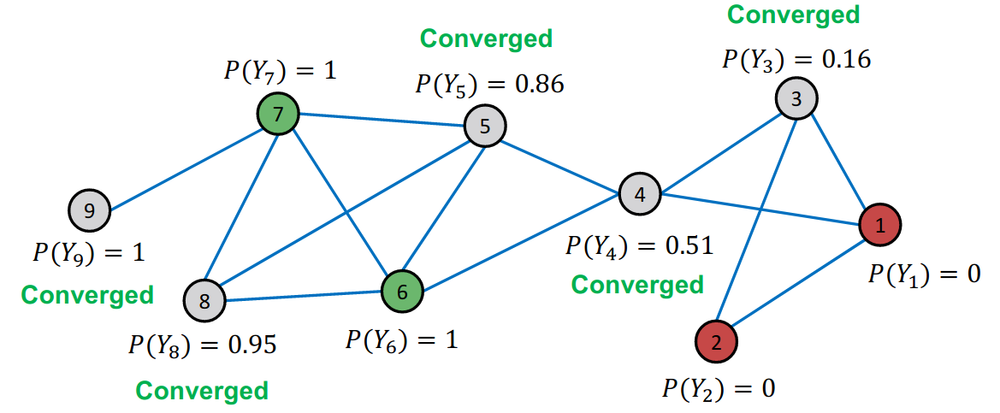
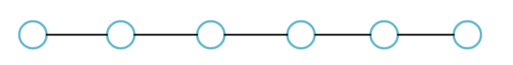
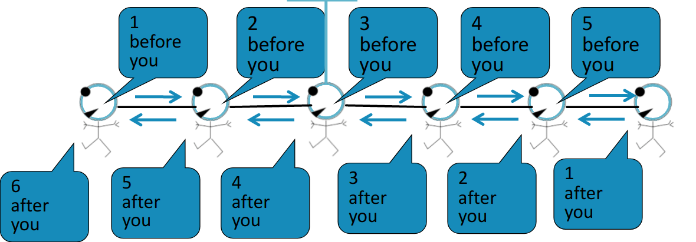

# Message Passing and Node Classification

**Example: Node classification**

Given labels of some nodes. Predict labels of unlabeled nodes. This is called semi-super sized node classification problem. The supervised signals and unsupervised signal are all provided at the same time.

**Question outline**

Given a network with labels on some nodes, how to assign labels to unlabeled nodes in the network. 

The solution is message passing

**Intuition**

Correlation exist in the network, which means similar node tends are connected. 

### Correlation in Network

In the graph, the nearby nodes have the same label.

Main type of dependencies that lead to correlation is  Homophily and Influence.

Homophily is a notion form social science, which means the people of similar characteristics tend to link each other .

Influence indicates the social connections influence people own characteristics or own behaviors. 

**Homophily**

The tendency of individuals to associate and bond with similar others. Researchers who forces on the same research area are more likely to establish a connection, such as meeting at conference, interacting in academic talks. 

**Influence**

Social connections can influence the individual characteristics of a person.

The next step is using Homophily and Influence observed in networks to help predict node labels.

Classification label of a node $v$ in network may depend on:

1. Feature of node $v$
2. Labels of the node $v's$ neighborhood
3. Features of the node $v's$ neighborhood

## Semi-supervised Learning 

**Given**: Graph and few labeled nodes

**Find**: class of remaining nodes

**Assumption**: There is some degree of homophily in the network.

**Application**

1. Document classification 
2. Part of speech tagging
3. Link Prediction
4. Optical character recognition

## Collective Classification

Simultaneous classification of interlinked nodes using correlations. The probabilistic framework is used.

**Markov Assumption** : the label $Y_v$ of one node $v$ depends on the labels of its neighbors $N_v$
$$
P(Y_v) = P(Y_v|N_v)
$$

**Main steps**

1. Local classifier: Assign initial labels
2. Relational Classifier: Capture correlations between nodes
3. Collective Inference: Propagate correlations through network

**Local classifier**

Predicts the label based on the node attributes or  features. It does not used any information from network.

**Relation classifier**

Learns a classifier to label one node based on the labels and/or attributes of its neighbors. It introduce the network information.

**Collective classifier**

Apply relational classifier to each node iteratively, until the inconsistency between neighboring labels is minimized (or to reach maximum iteration loop). Network structure affects the final prediction.

## Probabilistic Relational Classifier

**Basic idea**

Class probability $Y_v$ of node $v$ is a weighted average of class probabilities of tis neigbors.

For labeled nodes $v$, initialize label $Y_v$ with ground-truth label $Y_v^*$. For unlabeled nodes, initialize label $Y_v = 0.5$.

Update all nodes in a random order until convergence or maximum number of iteration is reached.

Update for each node $v$ and label $c$.
$$
P(Y_v = c) = \frac{1}{\sum\limits_{(v, y)\in E}A_{v,u}}\sum\limits_{(v,u)\in E}A_{v,u}P(Y_u =c)
$$
$P(Y_v = c)$ is the probability of node $v$ having label $c$.

If edges have stregth, $A_{v, u}$ can be tje edge weight between $v$ and $u$.

### Example

Initialize network. 

Update for the first iteraiton.

Randomly choose a Node update its probabiltiy, then iterative the rest nodes. A iteration indeicates update every nodes probability once.

Update for Node 3. 

Update for Node 4

Update for Node 5

The first Iteration result.

After four iterations, we can get converged result.

## Iteravtive classification

Main idea of iterative classification is classify node $v$ based on its attributes $f_v$ as well as labels  $z_v$ of neighbor set $N_v$.

### Question fomulation

**Input**: Graph

$f_v$ : feature vector for node $v$. Some nodes $v$ are labeled with $Y_v$

**Task:** Predict label of unlabeled nodes.

**Approach**: Train two classifiers.

$\phi_1(f_v)$:  Predict node label based on node feature vector $f_v$

$\phi_2(f_v)$: Predict label based on node feature vector $f_v$ and summary $z_v$ of labels of $v's$ neighbors.

### Computing the summary $z_v$

Ideas:

1. $z_v$ as the vector histogram of the number of each label in $N_v$
2. $z_v$ as the most common label in $N_v$
3. $z_v$ as the number of different labels in $N_v$

### Architecture of Iterative Classifier

#### Phase 1

classify based on node attributes alone.

On a training set, train classifier $\phi_1(f_v)$ to predict $Y_v$ based on $f_v$. $\phi_2(f_v, z_v)$ to predict $Y_v$ based on $f_v$ and summary $z_v$ of labels of $v's$ neighbors.

#### Phase 2

On test set, set labels $Y_v$ based on the classifer $\phi_1$, compute $z_v$ and predict the labels with $\phi_2$.

Repeat for each node $v$:

1. Update $z_v$ based on $Y_u$ for all $u\in N_v$
2. Update $Y_v$ based on the new $z_v$ by $\phi_2$

Iterative until class lables stablize or max number of iteration is reached.

#### Detailed step

1. Assign $z_v$ for each nodes.
2. train $\phi_1$ on training data.
3. train $\phi_2$ on training data.
4. using $\phi_1$ assign $Y_v$ for unlabled nodes.
5. Update all nodes $z_v$.
6. Re-classify each node with $\phi_2$
7. Repeat following procedure until convergence

		1. update all nodes $z_v$ based on its neighbors $Y_v$.
		1. update all noeds $Y_v$ based on $\phi_2$

## Belief Propagation

### Messgae passing: Basics

Task: count the number of nodes in a graph

Condition: Each node can only interact(pass meassage) with its neighbors.

Example: Straight line graph

Solution: Each node listens to the message form its neighbors and passes it forward.

We can also perform message passing on a tree-structured graph.

### Loopy BP Algorithm

**Label-Label potential matrix $\Psi$**

Dependency between a node and its neighbor. $\psi (Y_i, Y_j)$ is proportional to the probability of a node $j$ being in class $Y_j$, given that it has neighbor $i$ in class $Y_i$.

**Prior belief**   $\bold{\phi}$

$\phi(Y_i)$ is proportional to the probability of node $i$ being in class $Y_i$.

$m_{i\rightarrow j}(Y_j)$: is $i's$ message of $j$ being in class $Y_j$

$\mathcal{L}$ is the set of all classes.
$$
m_{i\rightarrow j}(Y_j) = \sum\limits_{Y_i \in \mathcal{L}}\psi(Y_i, Y_j) \phi_i(Y_i)\prod\limits_{k\in N_i} m_{k\rightarrow i} (Y_i) \forall Y_j \in \mathcal{L}
$$

Iteravtively update probabilities of node belonging to a label class based on its neighbors

Improve over collective classification to handle attribute/ feature informaiton

Clasify node $i$ based on its features as well as labels of neighbors.

