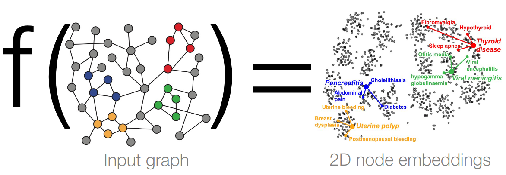
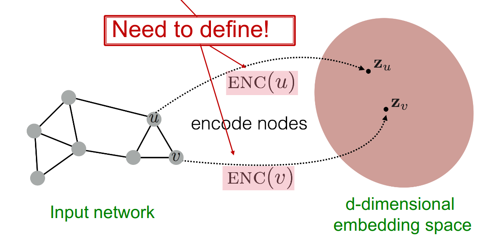
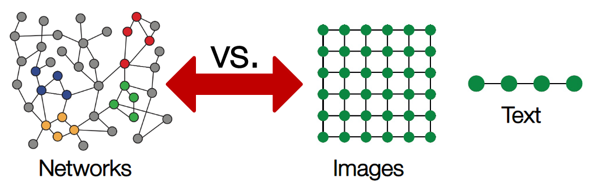
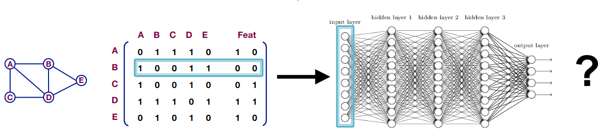
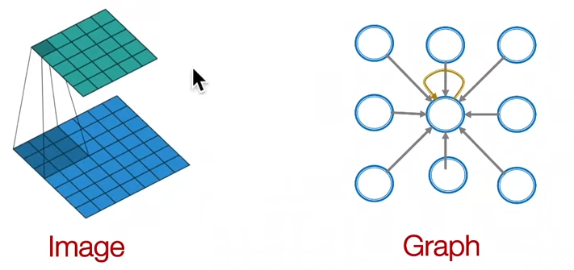
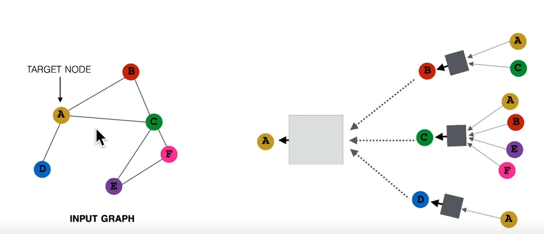
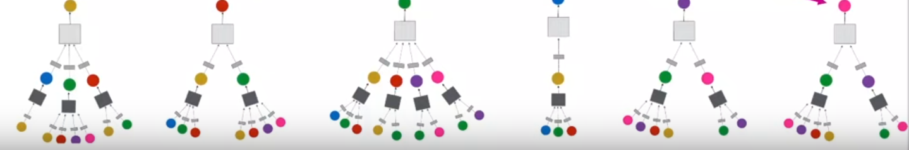
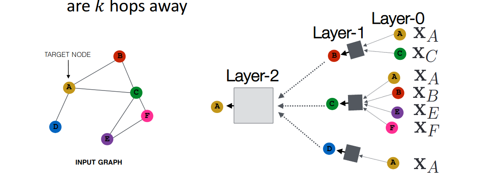

# 1 Graph Neural Networks

## 1. 1 Recap

Node Embeddings intuition: Map nodes to d-dimensional embeddings such that similar nodes in the graph are embedded close together.

Goal: similarity $(u, v) \approx \bold{z}_v^T\bold{z}_u$

Simplest encoding approach: encoder is just an embedding-lookup.

This lecture will present the deep learning encoder.

## 1.2 Task in Graph Neural Networks

1. Node classification: Predict a type of a given node
2. Link prediction: Predict whether two nodes are linked
3. Community detection: Identify densely linked clusters of nodes
4. Network similarity: How similar are two sub networks

Modern machine learning toolbox is designed for simple sequence and grids. Means the data is linear sequences or fixed size grid.

# 2. Local Network neighborhoods

Assume we have a graph $\bold{G}$

$V$ is the vertex set

$\bold{A}$ is the adjacency matrix

$\bold{X}\in \mathbb{R}^{m\times |V|}$ is a matrix of nodes features

$v$ is a node in $V$

$N(v)$ is set of neighbors of $v$

**Node features**

1. Social networks: User profile, User image
2. Biological networks: Gene expression profiles, gene functional information
3. When there is no node feature in the graph dataset: indicator vectors (one-hot encoding of a node); Vector of a constant 1 ({1, 1, 1, …, 1})

## 2.1 Naive Approach

Joint adjacency matrix and features, feed them into a neural network:

 Issues with this idea

1. $O(|V|)$ parameters
2. Not applicable to graphs of different sizes
3. Sensitive to node ordering

Idea is coming from the convolution neural network.

Goal is to generalize convolutions beyonds simple lattices Leverage node  features/attributes.

## 2.2 From Images to Graphs 

Single convolution neural network Layer with $3\times3$ filter

Idea is transform information at the neighbors and combine it:

1. Transform “Messages” $h_i$ from neighbors: $W_i h_i$
2. Add them up: $\sum\limits_{i} W_ih_i$

Graph convolution Network idea: Node’s neighborhood defines a computation graph. Learn how to propagate information across the graph to compute node features, how to create new message that then the next node up the chain can again aggregate.

Two step process:

1. Determine node computation graph
2. Propagate and transform information

## 2.3 Aggregate Neighbors

Key idea: Generate node embeddings based on local network neighborhoods.

Network neighborhood defines a computation graph. Every node defines a computation graph based on its neighbors.

## 2.4 Deep Model: many Layers

Model can be of arbitrary depth

Nodes have embedding at each layer: Layer-0 embedding of node $u$ is its input feature $x_u$. Layer-k embeddings gets information from nodes that are $K$ hops away.

## 2.5 Neighborhood Aggregation

Key distinctions are in how different approaches aggregate information across the layers

The order of the node in the graph is arbitrary, our aggregation operator to be permutation invariant.

Basic approach is Average information from neighbors and apply a neural network.

$h_v^0$: embeddings, $v$ means the node, 0 means the level of the neural network.
$$
\Large 
\begin{align}h_v^0 &= x_v\\
h_v^{l+1} &= \sigma(W_l\sum\limits_{u\in N(v)}^{} \frac{h_u^{l}}{|N(v)|} + B_lh_v^{(l)}), \forall l \in \{0, 1,...,L-1\}\\
z_v &= h_v^{L}
\end{align}
$$

The initial 0-th layer embeddings are equal to node features.

$h_v^{l}$: embeddings of the node $v$ from the previous layer. It need multiply with $B_l$

$N(v)$: node $v$ neighbors, we take the previous level embedding of every node $u$.

$|N(v)|$: Average of neighbor’s previous layer embeddings.

$\sigma$: Non-linearity function

$z_v$: Embeddings after L layers of neighborhood aggregation

## 2.6 Model Training

Recap the above equation, the Model parameters are $W_l$ and $B_l$. Different layer has different $W$ and $B$.

We can feed these embeddings into any loss function and run SGD to train the weight parameters. 

$h_v^l$: The hidden representation of node $v$ at layer $l$

$W_k$: Weight matrix for neighborhood aggregation

$B_k$: Weigh matrix for transforming hidden vector of self.

## 2.7 Matrix Formulation

Many aggregations can be performed efficiently by sparse matrix operations

Let  $\Large H^{l} = [h_1^{l}, h_2^{l},...,h_{|V|}^l]^T$

Then  $\Large \sum\limits_{u\in N_v}h_u^l = A_{v,:} H^l$

Let  $D$ be diagonal matrix where $D_{v,v} = Deg(v) = |N(v)|$

 The inverse of $D$: $D^{-1}$ is also diagonal

$\Large D_{v,v}^{-1} = \frac{1}{|N(v)|}$

Therefore 
$$
\Large \sum\limits_{u\in N(v)} \frac{h_u^{l-1}}{|N(v)|} = H^{l+1} = D^{-1}AH^l
$$

Rewriting update function in matrix form:
$$
\Large H^{l+1} = \sigma(\tilde{A}H^lW_l^T + H^lB_l^T)\;\;\;\;\;\;\;\tilde{A} = D^{-1}A
$$
Left is neighborhood aggregation, right is self transformation

In practice, this implies that efficient sparse matrix multiplication can be used ($\tilde{A}$ is sparse)

Node embedding $z_v$ is a function of input graph.

Supervised Learning: we want to minimize the loss $\mathcal{L}$
$$
\Large \min\limits_{\theta}\mathcal{L}(y, f(z_v))
$$
y is node label, $\mathcal{L}$ could be L2 if y is real number, or cross entropy if y is categorical.

## 2.8 Unsupervised Learning

For unsupervised Learning, No node label available.

We can use the graph structure as the supervision.

Similar nodes have similar embeddings:
$$
\Large \mathcal{L} =\sum\limits_{z_u,z_v} CE(y_{u,v}, DEC(z_u, z_v))
$$
where $y_{u,v} = 1$ when node $u$ and $v$ are similar.

CE is cross entropy.

DEC is the decoder such as inner product.

Node similarity can be anything, such as Random walks, Matrix factorization, Node proximity in the graph.

## 2.9 Supervised Learning

Directly train the model for a supervised task (node classification)

Safety or toxic drug.

Using cross entropy
$$
\Large \mathcal{L} = \sum\limits_{v\in V} y_vlog(\sigma(z_v^T\theta) ) + (1-y_v)log(1-\sigma(z_v^T\theta))
$$

