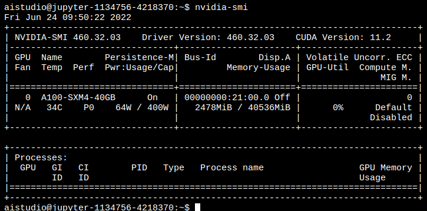
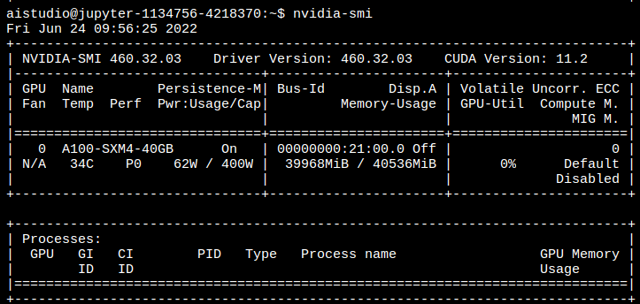

# Application for HILDA HPC

Dear HPC staff,

I am Xu Yang, an MSc Robotics student, and my IRP is AI in mood detection. I need to develop a DL system for mood classification in this project. I have a little experience in computer vision research, so this project is an excellent time to implement the SOTA model and decorate the model with fantastic tricks. After several testing on the Imperial College London HPC, Amazon EC2 instance, and Cloud server, I want to apply for HILDA access because the CRESCENT and DELTA are unsuitable. 
For CRESENT, it only has Tesla K40 GPU. K40 is a classic GPU in the early age of deep learning, but it is not good enough to handle modern deep learning training. K40 was released in 2013, and it only supports CUDA10, which means it cannot process the latest structure network, such as the Transformer family network and Complex attention processing.
For Delta, it has two configurations, and one is quad K80, another is quad V100. For K80, it was the same old antique as the K40 card, and I will not be elaborated here. For quad V100, if each V100 has 32 GB VRAM, it is enough for my training, but that graphic card is shared and assigned by the PBS queue. Therefore, I cannot guarantee I can always access these four cards. If each V100 only has 16 GB VRAM, it is not enough due to limited VRAM, and a detailed description of the VRAM problem will be explained later.
The number of high-performance GPUs for HILDA is enough for me to train a modern network. Besides, the latest CPU can also help me a lot. In training networks, the researcher must spend lots of time writing properly code for network structure. However, the data loader is also essential. If we load thousands of pictures at a single epoch and apply a complex transformation function, the system will wait for the data loader module. One of the solutions is using Async and Coroutines to optimize the data loader and training script. These two features are not easy to master, error-prone, and debug. So a powerful CPU is essential. Besides, I also use a vast dataset called "AffectNet," whose file size is over 130 GB, which is also a high burden for the system. I believe only HILDA can handle this volume dataset. In the GPU aspect, my model's bottleneck network is Vision in Transformer, which contains 1000M parameters. The required VRAM for storing the model is demonstrated as follows.

The training process is working on the RAF-DB dataset; each image resolution is 224 by 224 with three channels. The signal batch is 256, and the required VRAM is following.

And the single 32 GB GPU cannot support my IRP. Besides, the multi-card is also very helpful for me. PyTorch, MxNet, and Tensorflow provide model/data-parallel functions, enabling splitting the large batch into several small batches. And each graphic card only trains the corresponding small batch. After all small-batch training is complete, the result will be gathered and sent to the primary device for data integration. The powerful graphics card can also simplify the debug process and validation process.

The following graphic card has been tested for my network

A100- 80GB (SXM4 or PCIE)

A100-40GB (SXM4 or PCIE)

RTX A6000

