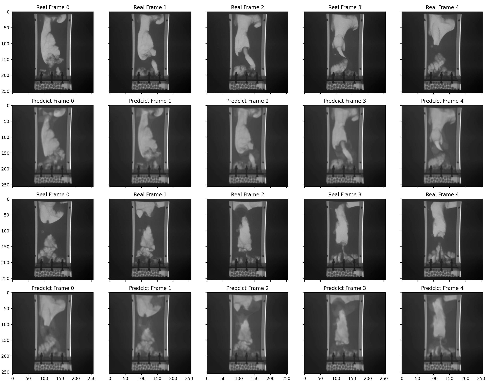

# ConvLSTM (20 to 1)

##  Exp 1

### Model Structure

```
Image Shape: (128, 128)
Num of Layer: 3
Parameter number:  10,178,497
```
### Training config

```
Optimizer: Adam
Epochs: 10
Loss: MSELoss with sum reduction
```
### Result


### Discussion
The predicted images roughly to be consitent with the target images in terms of motion.
From frame 0 to frame 4, we can obverse a bubble in the upper left approaching the two-phase plane and dieappearing at the end of frame. In addition, there are two bubbles on the right side that fused together during the ascent. Both of these two phenomena can be observed in the predicted frames.

From frame 5 to frame 9, a huge bubble hidden under the surface of the liquid, and then it splits into two large bubbles and eventlally disappears. This phenomena is also predicted by ConvLSTM model.

In the image detail aspect, the predicted images lack texture and quantitative estimation of bubbles size and shape. All of the images demonstrated bubbles are vague and lack of the determinent boundary with the environment.  


## Exp 2

### Model Structure

```
Image Shape: (256, 256)
Num of Layer: 3
Parameter number:  
```
### Training config

```
Optimizer: Adam
Epochs: 100
Loss: MSELoss with sum reduction
```
### Result




## Exp 3

### Model Structure

```
Image Shape: (256, 256)
Num of Layer: 3
Parameter number:  38,490,049
```

### Training config

```
Optimizer: Adam
Epochs: 20
Loss: MSELoss with sum reduction
```

### Result (Weired)


Looks like model collapse? But the nozzle and bottom circles are perfectly predicted.


# ConvLSTM (20 to 20)

## Exp 1

### Model Structure

```
Image Shape: (256, 256)
Num of Layer: 3
Parameter number:  10,178,497
```

### Training config

```
Optimizer: Adam
Epochs: 20
Loss: MSELoss with sum reduction
```

### Result

**Input**


**Target**


**Output**


## Exp 2

### Model Structure

```
Image Shape: (256, 256)
Num of Layer: 3
Parameter number:  10,178,497
```

### Training config

```
Optimizer: Adam
Epochs: 20
Loss: MSELoss with sum reduction
```

### Metric

```
Training Loss:661.65 
Validation Loss:617.19
SSIM: 
PSNR: 

```


# Next stage
1. Apply `SSIM`, `PSNR` and `VMAF` to determine the quality of the predicated video.
2. Split video by different initial condition, and test the performance
3. Check paper related to video predcition or motion prediciton.
4. Introduce of spatio-temporal correlation features
5. A refined dataset production