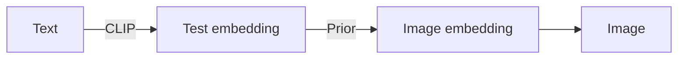
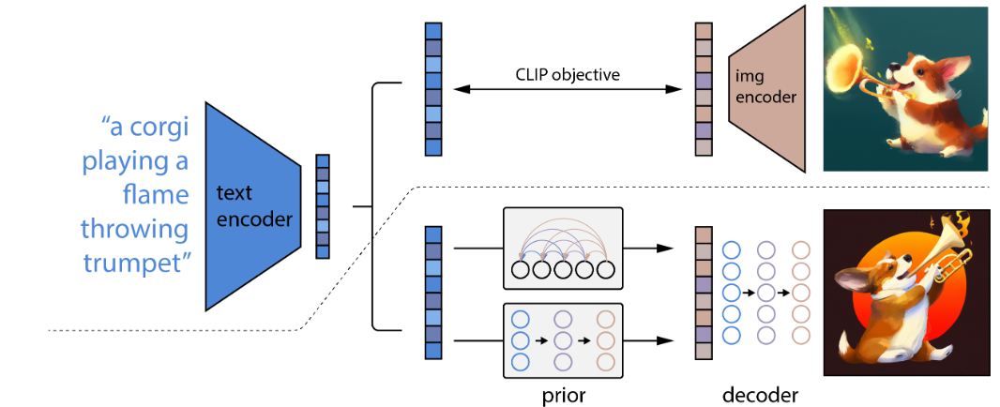
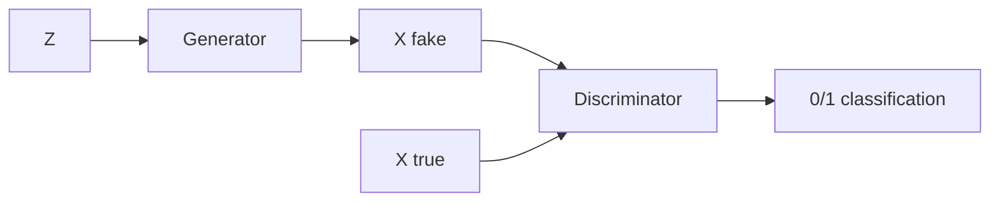
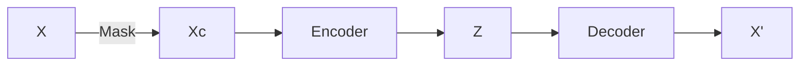
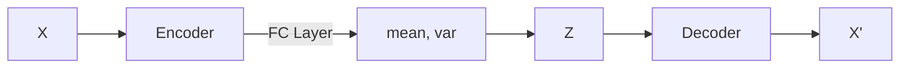
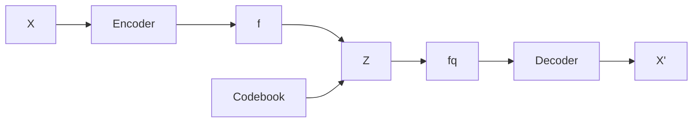

# Abstract

**Hierarchical**: DALLE2 generate a small resolution image first (e.g $64\times 64$), then using a model up-sample image to $256\times 256$, finally using another model up-sample image to $1024\times 1024$ image.

**CLIP Latents**: DALLE2 先训练CLIP模型，找到图片和文本对的关系。给定一个文本，CLIP的text encoder 可以将文本映射为一个embedding。

**Prior**：DALLE2 的**prior**模型输入是文本特征，输出是图像特征。

**Decoder**：给定一个图像特征，Decoder可以生成一个图像。





对于Decoder，作者尝试了autoregressive and Diffusion， 结果还是Diffusion更好。


# Introduction

CLIP have an impressive zero-shot capabilities. CLIP embeddings are robust to image distribution shift. However, for the OOD sample, CLIP does not work.

Diffusion model have emerged as a promising generative modeling framework. Diffusion model 是一种概率分布模型，它生成的图片是从一个分布中采样，所以diversity方面很好，但是在保真度方面差于GAN。但是通过guidance technique，Diffusion model可以牺牲部分diversity来获得更好的保真度(photorealism).



上半部分是CLIP，下半部分为DALLE2 模型。

文本和图像通过各自的encoder变成一个embedding，学习到的embedding是处于一个多模态的空间。当CLIP训练完后，其参数会被固定。

对于Prior+Decoder 部分，最朴素的做法是使用一个大的模型直接端到端的学习，但是作者发现如果中间先学习image embedding，再输出，则效果会好上一些。CLIP的图像特征作为Prior学习到的图像特征的监督 (ground truth)。Decoder 则将image embedding 转换为图片。


# Image generation

## GAN

生成对抗模型



Generator 通过噪音生成图片，Discriminator 判断图片是真或假的。通过两个网络的较量，可以获得比较真实的图片。GAN的目标函数就是用于与以假乱真，因此目前GAN的保真度很高。

GAN训练不够稳定，由于需要同时训练两个网络，因此需要平衡两个网络。 此外GAN的多样性不行，其多样性主要来源于开始的随机噪声$Z$。最后，GAN不是概率模型，所有的计算都是隐式的，因此我们无法知道内部发生了什么事情，不清楚内部遵循了什么分布。  


## VAE

Auto-Encoder 的结构如下。图片通过Encoder转换为bottleneck低维向量，然后通过Decoder将bottleneck转换为图像$x^{'}$。 我们希望$x^{'}$可以重建出$x$。

 ```mermaid
 graph LR
 A[X] --> B[Encoder]
 B --> C[Z]
 C --> D[Decoder]
 D --> E[X']
 
 ```

Denoising Auto-Encoder。 通过Mask操作我们扰动原图片，我们希望AE可以将扰动后的图片复原为初始图片。



DAE 和 AE主要目标是训练中间的bottleneck，然后将特征用于下游任务中。因此二者都不用于生成模型。主要原因为bottleneck不是一个概率分布，因此无法进行采样

Variational Auto-Encoder

VAE通过Encoder 学习一个分布， 假设分布是高斯分布。当我们得到编码结果后通过FC层去预测均值和方差。通过均值和方差去采样一个Z。从贝叶斯的角度来看，给X而生成Z是后验过程，学出的distribution是一个先prior distribution。给定一个Z去生成图片$X^{'}$是likelihood。整个过程可以summarize 为maximize likelihood。



Vector quantized VAE

现实额信号是连续的，但是具体表现形式缺都是离散化的。图片被像素表达，语音被采样。因此VQVAE不去学习分布，而是学习一个Codebook， 大小为$K\times D$ 。

通过Encoder，我们可以得到一个特征图，将特征图中的向量与Codebook中的向量做对比，观察它和哪个聚类中心最为接近。把最接近的中心的编码存到$Z$中。完成聚类分配后，我们不使用$f$，仅使用分配后的$f_q$ 做下游任务。




# Related works

DALL-E [1], Cog-View [2], NÜWA [3], GLIDE [4], ERNIE-ViLG [5]. DALL-E2 [6], Cog-Video [7], ImageN [8].


[1]. Ramesh, A., Pavlov, M., Goh, G., Gray, S., Voss, C., Radford, A., Chen, M. and Sutskever, I., 2021, July. Zero-shot text-to-image generation. In *International Conference on Machine Learning* (pp. 8821-8831). PMLR.

[2]. Ding, M., Yang, Z., Hong, W., Zheng, W., Zhou, C., Yin, D., Lin, J., Zou, X., Shao, Z., Yang, H. and Tang, J., 2021. Cogview: Mastering text-to-image generation via transformers. *Advances in Neural Information Processing Systems*, *34*, pp.19822-19835.

[3]. Wu, C., Liang, J., Ji, L., Yang, F., Fang, Y., Jiang, D. and Duan, N., 2021. N\" uwa: Visual synthesis pre-training for neural visual world creation. *arXiv preprint arXiv:2111.12417*.

[4]. Nichol, A., Dhariwal, P., Ramesh, A., Shyam, P., Mishkin, P., McGrew, B., Sutskever, I. and Chen, M., 2021. Glide: Towards photorealistic image generation and editing with text-guided diffusion models. *arXiv preprint arXiv:2112.10741*.

[5]. Zhang, H., Yin, W., Fang, Y., Li, L., Duan, B., Wu, Z., Sun, Y., Tian, H., Wu, H. and Wang, H., 2021. ERNIE-ViLG: Unified generative pre-training for bidirectional vision-language generation. *arXiv preprint arXiv:2112.15283*.

[6]. Ramesh, A., Dhariwal, P., Nichol, A., Chu, C. and Chen, M., 2022. Hierarchical text-conditional image generation with clip latents. *arXiv preprint arXiv:2204.06125*.

[7]. Hong, W., Ding, M., Zheng, W., Liu, X. and Tang, J., 2022. CogVideo: Large-scale Pretraining for Text-to-Video Generation via Transformers. *arXiv preprint arXiv:2205.15868*.

[8]. Saharia, C., Chan, W., Saxena, S., Li, L., Whang, J., Denton, E., Ghasemipour, S.K.S., Ayan, B.K., Mahdavi, S.S., Lopes, R.G. and Salimans, T., 2022. Photorealistic Text-to-Image Diffusion Models with Deep Language Understanding. *arXiv preprint arXiv:2205.11487*.


