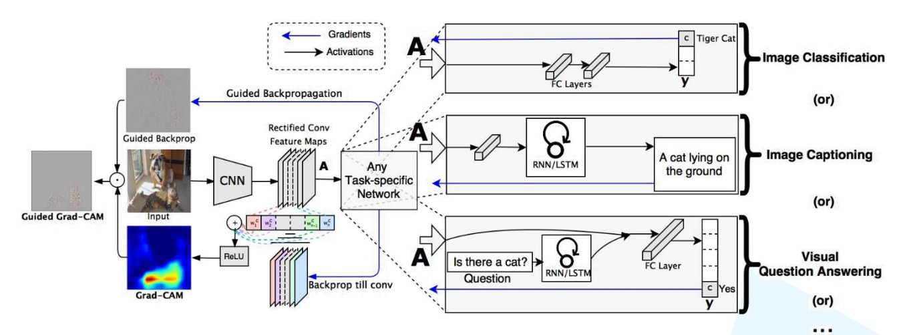

## Visual Explanations from deep networks via Gradient-based Localization

$$
\Large
L_{\text{Grad-CAM}}^{c} = \text{ReLU}(\sum\limits_{k}\alpha_k^c A^k)
$$
$A$: feature layer (normally the last constitutional layer output)

$k$: k-th channel in feature layer

$c$: class index

$A^k$: k-th channel data in feature map

$\alpha_k^c$: the k-th channel weight of feature layer for class $c$

$$
\Large
\alpha_k^c = \frac{1}{Z}\sum\limits_{i}\sum\limits_{j}\frac{\partial y^c}{\partial A_{ij}^{k}}
$$

