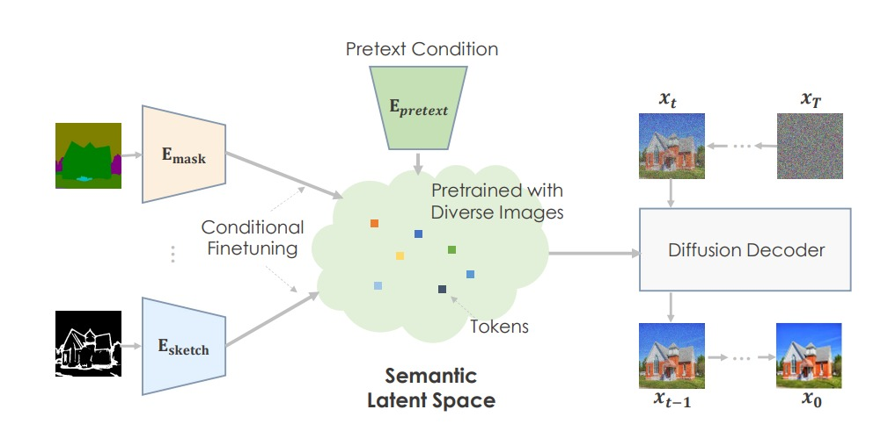

# 1. Structure

通过不同的pretext task 任务数据进行预训练，来的到一个高度语义的潜在空间。在下游任务中使用条件微调，将condition 映射到语义空间中。

## 1.1 Score Matching

Score Matching 是基于一个未知的IID 数据分布样本中学到未归一化的统计模型。我们可以直接训练一个score network $\large s_\theta(\bold{x})$ 在无需先训练模型去估计 $\large p_{data}(\bold{x})$ 的情况下去估计 $\large \nabla_x \log p_{data}(\bold{x})$ 。 最小化的目标函数为
$$
\Large
\frac{1}{2} \mathbb{E}\left[ \vert\vert s_\theta(\bold{x} - \nabla_x \log p_{data}(\bold{x}) \vert\vert_2^2 \right]
$$
上述公式可以等同于下式
$$
\Large
\mathbb{E}_{p_{data}(\bold{x})}\left[ \text{tr}(\nabla_x s_\theta(x)) + \frac{1}{2}\vert\vert s_\theta(x)\vert\vert_2^2 \right]
$$
$\large \nabla_x s_\theta(x)$ 是 $\large s_\theta(\bold{x})$ 的 Jacobian Matrix。 数据维度很大时，Jacobian Matrix的计算开销也会很大，因此使用Denoising Score Matching 去计算上述公式的Jacobian Matrix。

首先为数据 $\large x$ 添加噪声 $\large q_\sigma (\bar{\bold{x}}\vert \bold{x})$， 然后使用 score matching 去估计加噪后的数据分布
$$
\Large
q_{\sigma}(\bar{\bold{x}}) \triangleq \int q_\sigma (\bar{\bold{x}}\vert \bold{x})p_{data}(\bold{x}) d\bold{x}
$$

# Reference

1. Score-Based Generative Modeling through Stochastic Differential Equations
1. Improved Techniques for Training Score-Based Generative Models
1. Generative Modeling by Estimating Gradients of the Data Distribution
1. High-Resolution Image Synthesis with Latent Diffusion Models
