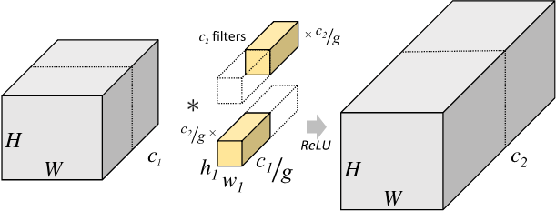

## Conv2d Function

parameters: dilation

用于计算膨胀卷积/空洞卷积

dilation = 1 是不计算，dilation = 2是在kernel 中插入0。
$$
\Large \begin{bmatrix}
1 & 2 & 3 \\
4 & 5 & 6 \\
7 & 8 & 9 
\end{bmatrix} \rightarrow \begin{bmatrix}
1 & 0 & 2 & 0 & 3 \\
0 & 0 & 0 & 0 & 0 \\
4 & 0 & 5 & 0 & 6 \\
0 & 0 & 0 & 0 & 0 \\
7 & 0 & 8 & 0 & 9 
\end{bmatrix}  
$$

parameters: groups

用于分组卷积计算 group convolution

若feature map 尺寸为$H\times W \times C_1$，kernel 尺寸为$h\times w\times c_1$， 输出的channel为$c_2$

所需要的参数量为$h\times w\times c_1 \times c_2$

在分组卷积中，图片会被分为g份，每份的尺寸为$H\times W\times \frac{C_1}{g}$， 对应的每份kernel尺寸为$h\times w\times \frac{c_1}{g}$，输出的channel 为$\frac{c_2}{g}$

将所有的结果concatenate，得到channel为$c_2$。

最终的参数量为$h\times w \times \frac{c_1}{g} \times \frac{c_2}{g} \times g = h\times w \times c_1 \times c_2\times \frac{1}{g}$ 

