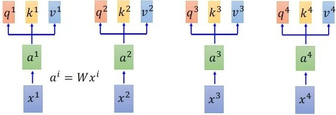
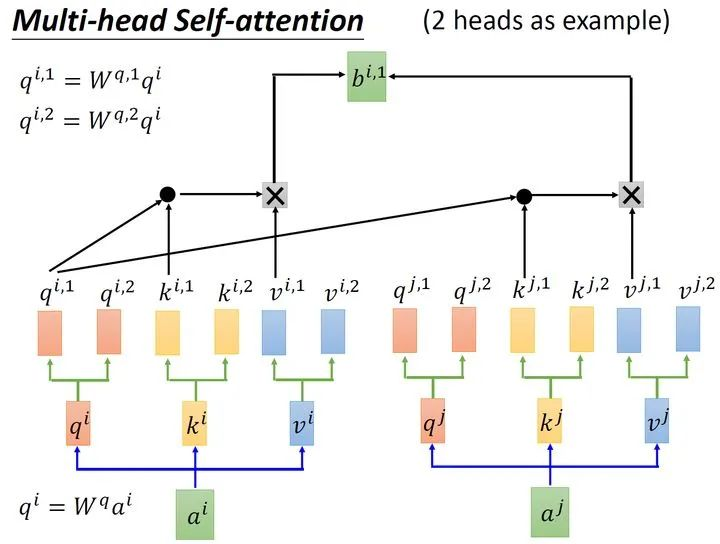

# Vision Transformer


首先将图片分解为多个块(patch)，然后美个快会被送入 Linear Projection of Flattened Patches 中。

实际上的作用与Embedding 层类似，得到的结果称之为Token。此外我们还需要加一个额外的Token，用于分类的class Token。

此外我们还需要加上一个位置信息，也就是Position encoder， 论文中的Position encoder 是使用可训练的参数。

所得到的Token会进入Transformer Encoder。其中Class Token 的结果会进入到MLP head 中用于网络的类别预测。

 

# 1. Embedding

对于标准的Transformer模块，要求输入的是Token 序列，即为二维矩阵 [num_token, token_dim].

代码实现中，直接通过一个卷积层来实现 ViT-B/16为例，使用卷积核大小$16\times16$,stride 为16，卷积核768
$$
\Large [224, 224,3] \rightarrow [14,14,768] \rightarrow [196, 768]
$$
在输入Transformer Encoder 之前需要加上 class token 和position embedding， 原论文中都是可训练数据。

拼接 class token： $Cat([1, 768], [196, 768]) \rightarrow [197, 768]$     [1, 768]是可训练的

叠加Position Embedding：$[197,768] + [197, 768] \rightarrow [197, 768]$


# 2. Position Embedding


原论文给出了不同的Position embedding 的结果。

无position embedding的准确率是0.61382.使用了一个一维的位置编码会提升3个百分点。

```
The difference in how to encode spatial information is less important
```


每个token 都会叠加一个position encoding。对每个patches 都会有一个自己的位置编码，将一个patch的位置编码和其他的位置编码做一个余弦相似度计算就会得到上述的图。自身和自身的相似度为1.
$$
\Large cos(A,B) = \frac{A \cdot B}{|A| |B|} 
$$


# 3. Transformer Encoder


# 4. MLP Head

Transformer Encoder前有个Dropout层，后有一个Layer Norm层。

训练ImageNet21K时候由Linear + tanh + Linear构成。

但是迁移到ImageNet1k或自己准备的数据集时，只有一个Linear层。若需要每个类别的概率，则需要加上一个SoftMax层


# 5. VIT

| Model     | Patch Size    | Layers | MLP Size | Heads | Params |
| --------- | ------------- | ------ | -------- | ----- | ------ |
| ViT-Base  | $16\times16$  | 768    | 3072     | 12    | 86M    |
| ViT-Large | $16\times 16$ | 1024   | 4096     | 16    | 307M   |
| ViT-Huge  | $16\times16$  | 1280   | 5120     | 16    | 632M   |

Layers: Transformer Encoder 中重复堆叠Encoder block的次数

Hidden Size: 通过Embedding层后每个token的dim。

MLP Size： Transformer Encoder中MLP Block第一个全连接层的节点个数 (Hidden Size 的四倍)

Heads：代表Transformer中Multi-head Attention的head数


# 6. VIT calculation

## 6.1 Original VIT

输入为$x^i$的向量，乘上$W$ 矩阵得到向量的embedding. 
$$
\Large a^i = Wx^i
$$
使用三个transformation matrix $W^q, W^k, W^v$ 来分别求解$q, k, v$ 矩阵
$$
\Large
\begin{align}
q^i &= W^q a^i\\
k^i &= W^k a^i\\
v^i &= W^v a^i
\end{align}
$$


每个query 和每个key相乘，得到attention，具体操作为self dot-product attention
$$
\Large \alpha_{i,j} = \frac{q^i*k^j}{\sqrt{d}}, d =\text{dimension})(q)
$$
若有四个输入，则对第一个输入的query attention结果为
$$
\Large
\alpha_{1,1} = \frac{q^1 * k^1}{\sqrt{d}}, \alpha_{1,2} = \frac{q^1 * k^2}{\sqrt{d}}, \alpha_{1,3} = \frac{q^1 * k^3}{\sqrt{d}},\alpha_{1,4} = \frac{q^1 * k^4}{\sqrt{d}}， *:\text{dot product}
$$
计算self-attention，先对query attention结果做soft-max 操作
$$
\Large
\hat{\alpha}_{1,1} = \frac{e^{\alpha_{1,1}}}{\sum\limits_{j}e^{\alpha_{1,j}}}, \hat{\alpha}_{1,2} = \frac{e^{\alpha_{1,2}}}{\sum\limits_{j}e^{\alpha_{1,j}}},\hat{\alpha}_{1,3} = \frac{e^{\alpha_{1,3}}}{\sum\limits_{j}e^{\alpha_{1,j}}}, \hat{\alpha}_{1,4} = \frac{e^{\alpha_{1,4}}}{\sum\limits_{j}e^{\alpha_{1,j}}}
$$
将上述的结果与用到的$v$值相乘并相加，得到attention结果
$$
\Large 
b^1 = \sum\limits_{i}\hat{\alpha_{1,i}}*v^i, b^2 = \sum\limits_{i}\hat{\alpha_{2,i}}*v^i, b^3 = \sum\limits_{i}\hat{\alpha_{3,i}}*v^i, b^4 = \sum\limits_{i}\hat{\alpha_{4,i}}*v^i
$$
$b^1, b^2, b^3, b^4$ 可以并行计算，相比RNN，每一步操作都是independent的，计算的效率更高。

## 6.2 Matrix Calculation

在实际计算过程中，如果我们的输入向量维度为$d_1\times1$, 并且我们有四个输入向量，则
$$
\Large
\text{input}= X = [x_1, x_2, x_3, x_4] = d_1 \times 4
$$
使用$W$ 矩阵计算embedding
$$
\Large a = W \cdot X = [a_1, a_2, a_3, a_4] = d_2 \times 4
$$
分别使用$W^q, W^k, W^v$ 乘以embedding 得到query， key 和value
$$
\Large
\begin{align}
q &= W^q \cdot a = [q_1, q_2, q_3, q_4] = d_3 \times 4\\
k &= W^k \cdot a = [k_1, k_2, k_3, k_4] = d_3 \times 4\\
v &= W^v \cdot a = [v_1, v_2, v_3, v_4] = d_3 \times 4
\end{align}
$$
计算query 和key 之间的self dot-product attention.
$$
\Large
\begin{bmatrix}
a_{1,1} & a_{2,1} & a_{3,1} & a_{4,1} \\
a_{1,2} & a_{2,2} & a_{3,2} & a_{4,2} \\
a_{1,3} & a_{2,3} & a_{3,3} & a_{4,3} \\
a_{1,4} & a_{2,4} & a_{3,4} & a_{4,4} 
\end{bmatrix} = \begin{bmatrix} k_1\\ k_2 \\ k_3 \\ k_4 \end{bmatrix} \cdot \begin{bmatrix}q_1 & q_2 & q_3 & q_4 \end{bmatrix} = (4\times d_3)\times(d_3\times4)
$$
对每列做Soft-Max 操作
$$
\Large
\hat{A} = 
\begin{bmatrix}
\hat{a}_{1,1} & \hat{a}_{2,1} & \hat{a}_{3,1} & \hat{a}_{4,1} \\
\hat{a}_{1,2} & \hat{a}_{2,2} & \hat{a}_{3,2} & \hat{a}_{4,2} \\
\hat{a}_{1,3} & \hat{a}_{2,3} & \hat{a}_{3,3} & \hat{a}_{4,3} \\
\hat{a}_{1,4} & \hat{a}_{2,4} & \hat{a}_{3,4} & \hat{a}_{4,4} 
\end{bmatrix} \leftarrow
\begin{bmatrix}
a_{1,1} & a_{2,1} & a_{3,1} & a_{4,1} \\
a_{1,2} & a_{2,2} & a_{3,2} & a_{4,2} \\
a_{1,3} & a_{2,3} & a_{3,3} & a_{4,3} \\
a_{1,4} & a_{2,4} & a_{3,4} & a_{4,4} 
\end{bmatrix}
$$


计算$\hat{A}$ 和V的attention
$$
\Large 
\begin{bmatrix}b_1 & b_2 & b_3 & b_4 \end{bmatrix} = \begin{bmatrix}v_1 & v_2 & v_3 & v_4 \end{bmatrix} \cdot \hat{A} = (d_3, 4)
$$

## 6.3  Multi-head Self-attention

在原版中，对于一个输入向量的embedding，我们可以计算出一组qkv，在multihead 中我们则会计算出多组出来，每一组qkv就是一个head


$$
\Large 
b_i = W_O \begin{bmatrix} b_{i,1}\\ b_{i,2}\end{bmatrix}
$$


