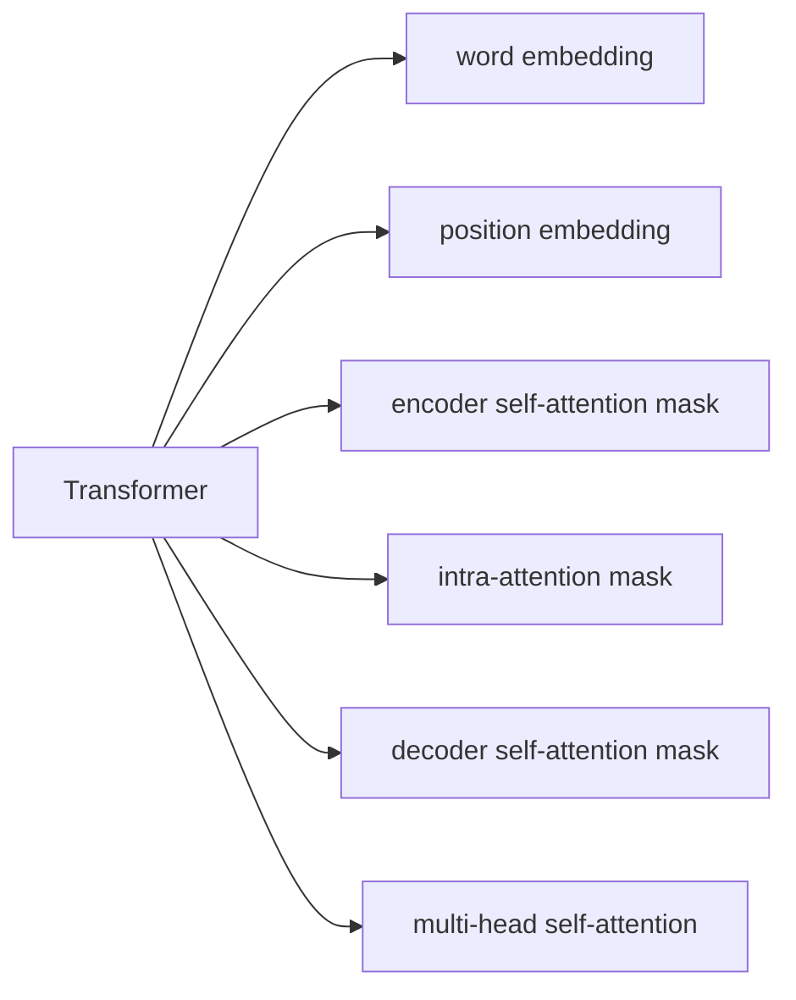

```mermaid
graph LR
A[Transformer] --> B[word embedding]
A --> C[position embedding]
A --> D[encoder self-attention mask]
A --> E[intra-attention mask]
A --> F[decoder self-attention mask]
A --> G[multi-head self-attention]
```

